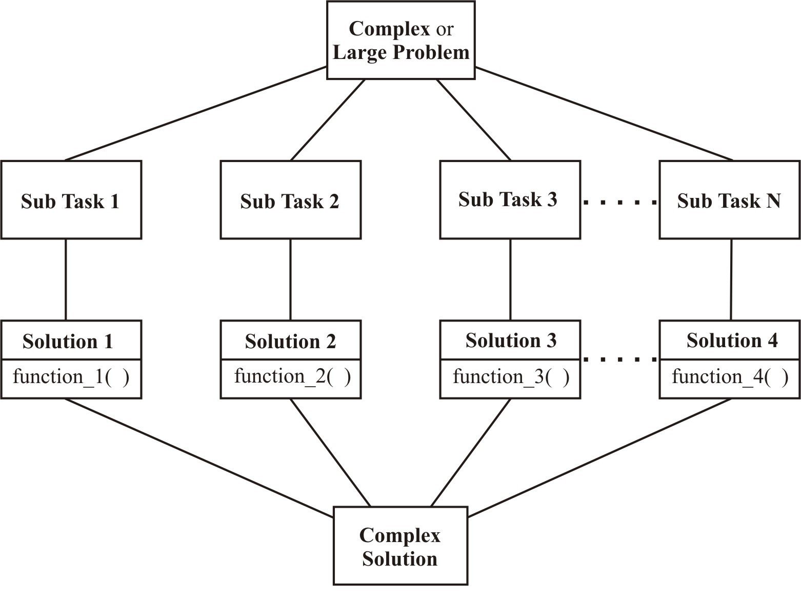

**MCS-201**

**Programming in C**

**and Python**

**Indira Gandhi National Open University**

**An introduction to C**

**1**

School of Computer and Information

Sciences (SOCIS)

>  style="width:1.74917in;height:0.75167in" />**MCS-201**

[**BLOCK 1** **AN INTRODUCTION TO** [**C**](#section)](#section)

[UNIT 1 Programming Fundamentals
[5](#unit-1-programming-fundamentals)](#unit-1-programming-fundamentals)

[UNIT 2 Data Types, Operators And Expressions
[33](#section-1)](#section-1)

[UNIT 3 Decision And Loop Control Statements [60](#unit-3)](#unit-3)

[UNIT 4 Arrays And Strings
[84](#unit-4-arrays-and-strings)](#unit-4-arrays-and-strings)

**BLOCK 2 FUNCTIONS, STRUCTURES, POINTERS**

**AND FILE HANDLING IN C**

UNIT 5 Functions 117

UNIT 6 Structures And Unions 139

UNIT 7 Pointers 155

UNIT 8 File Handling 177

**BLOCK 3 INTRODUCTION TO PYTHON**

**PROGRAMMING**

UNIT 9 Introduction To Python 199

UNIT 10 Data Structures And Control Statements In 213

Python

UNIT 11 Functions And Files Handling In Python 279

UNIT 12 Modules And Packages 300

**BLOCK 4 ADVANCED FEATURES IN PYTHON**

UNIT 13 Classes In Python 317

UNIT 14 Exception Handling In Python Programming 339

UNIT 15 Python-Advance Concepts 350

UNIT 16 Data Access Using Python 361

> **COURSE INTRODUCTION**
>
> This course introduces you the two most powerful programming languages
> i.e. C and Python. After completing this course you will be able to
> perform programming in both C and Python, the two are chosen to
> provide you the flavour of both conventional and modern programming.
> You will appreciate that both programming languages are equally
> powerful.
>
> To build the carrier path the skill of programming can be a fun and
> profitable way, but before starting the learning of this skill, one
> should be clear about the choice of programming language. Before
> learning any programming language, one should figure out which
> language suits best to the learner.
>
> This course makes you to compare the functionalities of both C and
> Python programming language, which may help the learners to analyse
> and generate a lot of opinions about their choice of programming
> language, from the comparison of C and Python, you will find that
> Python is an highlevel, general-purpose, interpreted programming
> language. It is dynamically typed and garbage-collected, and supports
> multiple programming paradigms like structured (particularly,
> procedural,) object-oriented, and functional programming, and due to
> its comprehensive standard library Python is often described as a
> "batteries included" language.
>
> Python programming is widely used in Artificial Intelligence, Machine
> Learning, Neural Networks and many other advanced fields of Computer
> Science. Ideally, It is designed for rapid prototyping of complex
> applications. Python has interfaces with various Operating system
> calls and libraries, which are extensible to C, C++ or Java. Many
> large companies like NASA, Google, YouTube, Bit Torrent, etc. uses the
> Python programming language for the execution of their valuable
> projects.
>
> This course gives you an exposure to both programming languages i.e. C
> and Python, based on your requirement you can choose your option to
> build your carrier in programming.
>
> **BLOCK INTRODUCTION**
>
> This block is on Introduction to C programming language.
>
> Problem-solving skills are recognized as an integral component of
> computer programming and in this block the primary focus of this
> course is to teach the basic programming constructs of C language.
> Emphasis is placed on developing the student's ability to apply
> problem-solving strategies to design algorithms and to implement these
> algorithms in a structured procedural programming language. This
> course includes a laboratory componentalso where in which the student
> gets the hands on experience.Basically one must explore possible
> avenues to a solution one by one until s/he comes across a right path
> to an optimized and efficient solution. In general, as one gains
> experience in solving problems, one develops his/her own techniques
> and strategies, though they are often intangible.
>
> This block consists of 4 units and is organized as follows:
>
> Unit- 1 provides an overview of problem solving techniques, algorithm
> design, top – down design and basic C language features
>
> Unit -2outlines the overview of the various datatypes, operators and
> expressions in C.
>
> Unit – 3 provides an overview of the decision and control loop
> statements in C language.
>
> Unit - 4 introduces you the concept of the Arrays and String-handling
> in the C programs.
>
> *Happy Programming!!*
>
>  style="width:0.44417in;height:0.39833in" /> Indira Gandhi National
> Open University **MCS-201** School of Computer and Information
> Sciences
>
> **PROGRAMMING IN C AND PYTHON**
>
> Block

# 1 

> **AN INTRODUCTION TO C**

# UNIT 1 Programming Fundamentals 

**UNIT 2**

**Data Types, Operators and Expressions**

#  

# UNIT 3 

> **Decision and Loop Control Statements**

# UNIT 4 Arrays and Strings 

> **Programme / Course Design Committee**

<table>
<colgroup>
<col style="width: 50%" />
<col style="width: 49%" />
</colgroup>
<thead>
<tr>
<th><blockquote>

Prof. Sanjeev K. Aggarwal, IIT, Kanpur

Prof. M. Balakrishnan, IIT , Delhi

Prof Harish Karnick, IIT, Kanpur

Prof. C. Pandurangan, IIT, Madras

Dr. Om Vikas, Sr. Director, MIT

Prof P. S. Grover, Sr. Consultant,

Prof. (Retd.) S.K. Gupta IIT, Delhi

Prof. T.V. Vijay Kumar

Dean,

School of Computer &amp; System Sciences, JNU, New Delhi

Prof. Ela Kumar,

Dean, Computer Science &amp; Engg IGDTUW, Delhi

Prof. Gayatri Dhingra

GVMITM, Sonipat, Haryana

Mr. Milind Mahajani

Vice President

Impressico Business Solutions Noida UP

</blockquote></th>
<th>
Prof. V.V. Subrahmanyam

Director

SOCIS, IGNOU, New Delhi

Prof P. Venkata Suresh

SOCIS, IGNOU, New Delhi

Dr. Shashi Bhushan

Associate Professor

SOCIS, IGNOU, New Delhi

Shri Akshay Kumar

Associate Professor

SOCIS, IGNOU, New Delhi

Shri M. P. Mishra

Associate Professor

SOCIS, IGNOU, New Delhi

Dr. Sudhansh Sharma

Asst. Professor

SOCIS, IGNOU, New Delhi
</th>
</tr>
</thead>
<tbody>
<tr>
<td><blockquote>

<strong>Block Preparation Team</strong>

</blockquote></td>
<td></td>
</tr>
</tbody>
</table>

Prof P. S. Grover (Content Editor) Ms. Priti Sehgal

(Sr Consultant Dept. of Computer Science

SOCIS, IGNOU) Keshav Mahavidyalya

University of Delhi

Ms. Charu Devgon

Dept. of Computer Science Prof. V.V. Subrahmanyam

A N Dev College SOCIS, IGNOU

University of Delhi

Shri S.S. Rana

Ms. Namita Gupta New Delhi Language

Dept. of Computer Science Editors

Maharaja Agrasen Institute Prof Sunaina Kumar,

of Technology SOH, IGNOU

Delhi

> **Course Coordinator : Dr. Sudhansh Sharma**
>
> **(Units 1 to 4 are adapted from MCS-011 Problem Solving and
> Programming)**

**Block Production Team**

### March, 2021 

***Indira Gandhi National Open University, 2021***

> ***ISBN-***
>
> *All rights reserved. No part of this work may be reproduced in any
> form, by mimeograph or any other means, without permission in writing
> from the Indira Gandhi National Open University.*
>
> *Further information on the Indira Gandhi National Open University
> courses may be obtained from the University’s office at Maidan Garhi,
> New Delhi-110 068.*

**UNIT 1 PROGRAMMING FUNDAMENTALS**

**Structure**

> 1.0 Introduction
>
> 1.1 Objectives
>
> 1.2 Problem - Solving Techniques
>
> 1.2.1 Steps for Problem - Solving 1.2.2 Using Computer as a
> Problem-Solving Tool
>
> 1.3 Basics of Algorithms
>
> 1.3.1 Definition 1.3.2 Features of Algorithm 1.3.3 Criteria to be
> followed by an Algorithm 1.3.4 Top-Down Design
>
> 1.4 Flowcharts

##  1.4.1 Basic Symbols used in Flowchart Design 

> 1.5 Program and a Programming Language
>
> 1.6 Structured Programming Concepts
>
> 1.7 C Programming Language

##  1.7.1 History of C Programming Language 1.7.2 Salient Features of C 

> 1.8 Writing a C Program
>
> 1.9 Compiling a C Program

1.9.1 The C Compiler 1.9.2 Syntax and Semantic Errors

> 1.10 Link and Run the C Program

## 1.10.1 Run the C Program through the Menu 1.10.2 Run from an Executable File 1.10.3 Linker Errors 1.10.4 Logical and Runtime Errors 

> 1.11 Diagrammatic Representation ofC Program Execution Process
>
> 1.12 Summary
>
> 1.13 Solutions / Answers
>
> 1.14 Further Readings

**1.0 INTRODUCTION**

> In our daily life, we routinely encounter and solve problems. We pose
> problems that we need or want to solve. For this, we make use of
> available resources, and solve them. Some categories of resources
> include: the time and efforts of yours and others; tools; information;
> and money. Some of the problems that you encounter and solve are quite
> simple.But some others may be very complex.
>
> In this unit we introduce you to the concepts of problem-solving,
> especially as they pertain to computer programming**.**
>
> The problem-solving is a skill and there are no universal approaches
> one can take to solving problems. Basically one must explore possible
> avenues to a solution one by one until s/he comes across a right path
> to a solution. In general, as one gains experience in solving
> problems, one develops one’s own techniques and strategies, though
> they are often intangible. Problem-solving skills are recognized as an
> integral component of computer programming. It is a demand and
> intricate process which is equally important throughout the project
> life cycle especially – study, designing, development, testing and
> implementation stages. The computer problem solving process requires:

- Problem anticipation

- Careful planning

- Proper thought process

- Logical precision

- Problem analysis

- Persistence and attention.

> At the same time it requires personal creativity, analytic ability and
> expression. The chances of success are amplified when the problem
> solving is approached in a systematic way and satisfaction is achieved
> once the problem is satisfactorily solved. The problems should be
> anticipated in advance as far as possible and properly defined to help
> the algorithm definition and development process.
>
> Computer is a very powerful tool for solving problems. It is a
> symbolmanipulating machine that follows a set of stored instructions
> called a program. It performs these manipulations very quickly and has
> memory for storing input, lists of commands and output. A computer
> cannot think in the way we associate with humans. When using the
> computer to solve a problem, you must specify the needed initial data,
> the operations which need to be performed (in order of performance)
> and what results you want for output. If any of these instructions are
> missing, you will get either no results or invalid results. In either
> case, your problem has not yet been solved. Therefore, several steps
> need to be considered before writing a program. These steps may free
> you from hours of finding and removing errors in your program (a
> process called **debugging**). It should also make the act of problem
> solving with a computer a much simpler task.
>
> All types of computer programs are collectively referred to as
> **software**. Programming languages are also part of it. Physical
> computer equipment such as electronic circuitry, input/output devices,
> storage media etc. comes under **hardware**. Software governs the
> functioning of hardware. Operations performed by software may be built
> into the hardware, while instructions executed by the hardware may be
> generated in software. The decision to incorporate certain functions
> in the hardware and others in the software is made by the manufacturer
> and designer of the software and hardware. Normal considerations for
> this are: cost, speed, memory required, adaptability and reliability
> of the system. Set of instructions of the high level language used to
> code a problem to find its solution is referred to as **Source
> Program**. A translator program called **a compiler or interpreter**,
> translates the source program into the object program. This is the
> compilation or interpretation phase. All the testing of the source
> program as regards the correct format of instructions is performed at
> this stage and the errors, if any, are printed. If there is no error,
> the source program is transformed into the machine language program
> called **Object Program**. The Object Program is executed to perform
> calculations. This stage is the execution phase. Data, if required by
> the program, are supplied now and the results are obtained on the
> output device.
>
> The complete process is shown in fig 1.1 below:

Results

Source

Program

Compiler /

Interpreter

Object

Program

Data,

if

required

**Fig 1.1: Conversion of Source Program to Object Program**

**1.1 OBJECTIVES**

> After going through this unit, you should be able to:

- apply problem solving techniques;

- define an algorithm and its features;

- design flowcharts;  Define a program;

- Understand the history of C programming language;

- Compile a C program;

- Identify the syntax errors;

- Run a C program; and

- Understand what are run time and logical errors.

**1.2 PROBLEM - SOLVING TECHNIQUES**

> Problem solving is a creative process which defines systematization
> and mechanization. There are a number of steps that can be taken to
> raise the level of one’s performance in problem solving.

## 1.2.1 Steps for Problem - Solving 

> A problem-solving technique follows certain steps in finding the
> solution to a problem. Let us look into the steps one by one:

### Problem definition phase 

> The success in solving any problem is possible only after the problem
> has been fully understood. That is, we cannot hope to solve a problem,
> which we do not understand. So, the problem understanding is the first
> step towards the solution of the problem. In *problem definition
> phase*, we must emphasize *what must be done* rather than *how is it
> to be done*. That is, we try to extract the precisely defined set of
> tasks from the problem statement. Inexperienced problem solvers too
> often gallop ahead with the task of problem - solving only to find
> that they are either solving the wrong problem or solving just one
> particular problem.

#### Getting started on a problem 

> There are many ways of solving a problem and there may be several
> solutions. So, it is difficult to recognize immediately which path
> could be more productive. Sometimes you do not have any idea where to
> begin solving a problem, even if the problem has been defined. Such
> block sometimes occurs because you are overly concerned with the
> details of the implementation even before you have completely
> understood or worked out a solution. The best advice is not to get
> concerned with the details. Those can come later when the intricacies
> of the problem has been understood.

### The use of specific examples 

> To get started on a problem, we can make use of heuristics i.e., the
> rule of thumb. This approach will allow us to start on the problem by
> picking a specific problem we wish to solve and try to work out the
> mechanism that will allow solving this particular problem. It is
> usually much easier to work out the details of a solution to a
> specific problem because the relationship between the mechanism and
> the problem is more clearly defined. This approach of focusing on a
> particular problem can give us the foothold we need for making a start
> on the solution to the general problem.

### Similarities among problems 

> One way to make a start is by considering a specific example. Another
> approach is to bring the experience to bear on the current problem.
> So, it is important to see if there are any similarities between the
> current problem and the past problems which we have solved. The more
> experience one has the more tools and techniques one can bring to bear
> in tackling the given problem. But sometimes, it blocks us from
> discovering a desirable or better solution to the problem. A skill
> that is important to try to develop in problem - solving is the
> ability to view a problem from a variety of angles. One must be able
> to metaphorically turn a problem upside down, inside out, sideways,
> backwards, forwards and so on. Once one has developed this skill it
> should be possible to get started on any problem.

### Working backwards from the solution 

> In some cases we can assume that we already have the solution to the
> problem and then try to work backwards to the starting point. Even a
> guess at the solution to the problem may be enough to give us a
> foothold to start on the problem. We can systematize the
> investigations and avoid duplicate efforts by writing down the various
> steps taken and explorations made. Another practice that helps to
> develop the problem solving skills is, once we have solved a problem,
> to consciously reflect back on the way we went about discovering the
> solution.

## 1.2.2 Using Computer as a Problem - Solving Tool 

> The computer is a resource - a versatile tool - that can help you
> solve some of the problems that you encounter. A computer is a very
> powerful generalpurpose tool. Computers can solve or help to solve
> many types of problems. There are also many ways in which a computer
> can enhance the effectiveness of the time and effort that you are
> willing to devote to solving a problem. Thus, it will prove to be well
> worth the time and effort you spend to learn how to make effective use
> of this tool.
>
> In this section, we discuss the steps involved in developing a
> program. Program development is a multi-step process that requires you
> to understand the problem, develop a solution, write the program, and
> then test it. This critical process determines the overall quality and
> success of your program. If you carefully design each program using
> good structured development techniques, your programs will be
> efficient, error-free, and easy to maintain. The following are the
> steps in detail:

1.  Develop an *Algorithm* and a *Flowchart*.

2.  Write the program in a computer language (for example say C
    programming language).

3.  Enter the program using some editor.

4.  Test and debug the program.

5.  Run the program, input data, and get the results.

**1.3 BASICS OF ALGORITHMS**

> The first step in the program development is to devise and describe a
> precise plan of what you want the computer to do. This plan, expressed
> as a sequence of operations, is called an algorithm. An algorithm is
> just an outline or idea behind a program something resembling C or
> Pascal, but with some statements in English rather than within the
> programming language. It is expected that one could translate each
> pseudo-code statement to a small number of lines of actual code,
> easily and mechanically.

## 1.3.1 Definition 

> An **algorithm** is a finite set of steps defining the solution of a
> particular problem. An algorithm is expressed in pseudocode -
> something resembling C language or Pascal, but with some statements in
> English rather than within the programming language. Developing an
> efficient algorithm requires lot of practice and skill. It must be
> noted that an efficient algorithm is one which is capable of giving
> the solution to the problem by using minimum resources of the system
> such as memory and processor’s time. Algorithm is a language
> independent, well structured and detailed. It will enable the
> programmer to translate into a computer program using any high-level
> language. **1.3.2 Features of Algorithm**
>
> Following features should be present in an algorithm:

## Proper understanding of the problem 

> For designing an efficient algorithm, the expectations from the
> algorithm should be clearly defined so that the person developing the
> algorithm can understand the expectations from it. This is normally
> the outcome of the problem definition phase.

## Use of procedures / functions to emphasize modularity 

> To assist the development, implementation and readability of the
> program, it is usually helpful to modularize (section) the program.
> Independent functions perform specific and well defined tasks. In
> applying modularization, it is important to watch that the process is
> not taken so far to a point at which the implementation becomes
> difficult to read because of fragmentation. The program then can be
> implemented as calls to the various procedures that will be needed in
> the final implementations.

## Choice of variable names 

> Proper variable names and constant names can make the program more
> meaningful and easier to understand. This practice tends to make the
> program more self documenting. A clear definition of all variables and
> constants at the start of the procedure / algorithm can also be
> helpful. For example, it is better to use variable *day* for the day
> of the weeks, instead of the variable *a* or something else.

## Documentation of the program 

> Brief information about the segment of the code can be included in the
> program to facilitate debugging and providing information. A related
> part of the documentation is the information that the programmer
> presents to the user during the execution of the program. Since, the
> program is often to be used by persons who are unfamiliar with the
> working and input requirements of the program, proper documentation
> must be provided. That is, the program must specify what responses are
> required from the user. Care should also be taken to avoid ambiguities
> in these specifications. Also the program should “catch” incorrect
> responses to its requests and inform the user in an appropriate
> manner.

## 1.3.3 Criteria to be followed by an Algorithm 

> The following is the criteria to be followed by an algorithm:

- **Input:** There should be zero or more values which are to be
  supplied.

- **Output:** At least one result is to be produced.

- **Definiteness:** Each step must be clear and unambiguous.

- **Finiteness:** If we trace the steps of an algorithm, then for all
  cases, the algorithm must terminate after a finite number of steps.

- **Effectiveness:** Each step must be sufficiently basic that a person
  using only paper and pencil can in principle carry it out. In
  addition, not only each step is definite, it must also be feasible.

### Example 1.1 

> Let us try to develop an algorithm to compute and display the sum of
> two numbers

1.  Start

2.  Read two numbers *a* and *b*

3.  Calculate the sum of *a* and *b* and store it in *sum*

4.  Display the value of *sum*

5.  Stop

### Example 1.2 

> Let us try to develop an algorithm to compute and print the average of
> a set of data values.

1.  Start

2.  Set the sum of the data values and the count to zero.

3.  As long as the data values exist, add the next data value to the sum
    and add 1 to the count.

4.  To compute the average, divide the sum by the count.

5.  Display the average.

6.  Stop

### Example 1.3 

> Write an algorithm to calculate the factorial of a given number.

1.  Start

2.  Read the number n

3.  \[Initialize\] i 1 , fact  1

4.  Repeat steps 4 through 6 until i = n

5.  fact  fact \* i

6.  i  i + 1

7.  Print fact

8.  Stop

### Example 1.4 

> Write an algorithm to check that whether the given number is prime or
> not.

1.  Start

2.  Read the number num

3.  \[Initialize\] i 2 , flag  1

4.  Repeat steps 4 through 6 until i \< num or flag = 0

5.  rem  num mod i

6.  if rem = 0 then

> flag 0 else i i + 1

7.  if flag = 0 then

Print Number is not prime

Else

Print Number is prime

8.  Stop

## 1.3.4 Top Down Design 

> Once we have defined the problem and have an idea of how to solve it,
> we can then use the powerful techniques for designing algorithms. Most
> of the problems are complex or large problems and to solve them we
> have to focus on to comprehend at one time, a very limited span of
> logic or instructions. A technique for algorithm design that tries to
> accommodate this human limitation is known as **top-down design or
> stepwise refinement.**
>
> Top down design provides the way of handling the logical complexity
> and detail encountered in computer algorithm. It allows building
> solutions to problems in step by step. In this way, specific and
> complex details of the implementation are encountered only at the
> stage when sufficient groundwork on the overall structure and
> relationships among the various parts of the problem.Before the top
> down design can be applied to any problem, we must at least have the
> outlines of a solution. Sometimes this might demand a lengthy and
> creative investigation into the problem while at another time the
> problem description may in itself provide the necessary starting point
> for the top-down design. Top-down design suggests taking the general
> statements about the solution one at a time, and then breaking them
> down into a more precise subtask / sub-problem. These sub-problems
> should more accurately describe how the final goal can be reached. The
> process of repeatedly breaking a task down into a subtask and then
> each subtask into smaller subtasks must continue until the sub-problem
> can be implemented as the program statement. With each spitting, it is
> essential to define how sub-problems interact with each other. In this
> way, the overall structure of the solution to the problem can be
> maintained. Preservation of the overall structure is important for
> making the algorithm comprehensible and also for making it possible to
> prove the correctness of the solution.

### Figure 1.2: Schematic breakdown of a problem into subtasks as employed in top down design 

> Let us see how to represent the algorithm in a graphical form using a
> flowchart in the following section.

**1.4 FLOWCHARTS**

> The next step after the algorithm development is the flowcharting.
> Flowcharts are used in programming to diagram the path in which
> information is processed through a computer to obtain the desired
> results. Flowchart is a graphical representation of an algorithm. It
> makes use of symbols which are connected among them to indicate the
> flow of information and processing. It will show the general outline
> of how to solve a problem or perform a task. It is prepared for better
> understanding of the algorithm.

##  1.4.1 Basic Symbols used in flowchart design 

Lines or arrows represent the direction of

Start/Stop

D

ECISION MAKING

(

Branching)

Input/

Output

the flow of control.

> Connector (connect one part of the
>
> flowchart to another)

Process, Instruction

|     |     |
|-----|-----|
|     |     |

Comments, Explanations, Definitions

### Additional Symbols Related to more advanced programming 

Refers to separate flowchart

Preparation (may be used with “do Loops” )

### Example 1.5 

The flowchart for the Example 1.1 is shown below:

Sta

r

t

Stop

Print sum

Sum = a +b

Read a,b

### Example 1.6 

> The flowchart for the Example 1.3 (to find factorial of a given
> number) is

shown low:

No

Yes

Start

Stop

Read n

i= 1

fact= 1

Print

fact

is i

\<=

n?

i = i+1

fact = fact\*i

**Example 1.7:**

> The flowchart for Example 1.4 is shown below:

Start

Read num

i = 2

flag = 1

rem =

num mod i

is

i\<num?

is

flag = 0?

i = i + 1

is rem

0?

!=

flag = 0

is flag

= 1?

Print

“Number

is prime

Print

“number is

not prime”

no

y

es

no

stop

yes

y

es

no

y

es

no

### Check Your Progress 1 

1.  Differentiate between flowchart and algorithm.

> ……………………………………………………………………………………...
>
> ……………………………………………………………………………………...
>
> ……………………………………………………………………………………...
>
> ……………………………………………………………………………………...
>
> ……………………………………………………………………………………...

2.  Compute and print the sum of a set of data values.

> ……………………………………………………………………………………...
>
> ……………………………………………………………………………………...
>
> ……………………………………………………………………………………...
>
> ……………………………………………………………………………………...
>
> ……………………………………………………………………………………...

3.  Write the following steps are suggested to facilitate the problem
    solving process using computer.

> ……………………………………………………………………………………...
>
> ……………………………………………………………………………………...
>
> ……………………………………………………………………………………...
>
> ……………………………………………………………………………………...
>
> ……………………………………………………………………………………...

4.  Draw an algorithm and flowchart to calculate the roots of quadratic
    equation

> Ax^2 + Bx + C = 0.
>
> ……………………………………………………………………………………...
>
> ……………………………………………………………………………………...
>
> ……………………………………………………………………………………...
>
> ……………………………………………………………………………………...
>
> ……………………………………………………………………………………...

**1.5 PROGRAM AND PROGRAMMING LANGUAGE**

> A language is a mode of communication between two people. It is
> necessary for those two people to understand the language in order to
> communicate. But even if the two people do not understand the same
> language, a translator can help to convert one language to the other,
> understood by the second person. Similar to a translator is the mode
> of communication between a user and a computer is a computer language.
> One form of the computer language is understood by the user, while in
> the other form it is understood by the computer. A translator (or
> compiler) is needed to convert from user’s form to computer’s form.
> Like other languages, a computer language also follows a particular
> grammar known as the syntax.
>
> In this unit we will introduce you the basics of programming language
> C.
>
> We have seen in the earlier section’s that a computer has to be fed
> with a detailed set of instructions and data for solving a problem.
> Such a procedure which we call an *algorithm* is a series of steps
> arranged in a logical sequence. Also we have seen that a *flowchart*
> is a pictorial representation of a sequence of instructions given to
> the computer. It also serves as a document explaining the procedure
> used to solve a problem. In practice it is necessary to express an
> algorithm using a *programming language*. A procedure expressed in a
> programming language is known as a *computer program*.
>
> Computer programming languages are developed with the primary
> objective of facilitating a large number of people to use computers
> without the need for them to know in detail the internal structure of
> the computer. Languages are designed to be *machine-independent*. Most
> of the programming languages ideally designed, to execute a program on
> any computer regardless of who manufactured it or what model it is.
>
> Programming languages can be divided into two categories:

1)  **Low Level Languages or Machine Oriented Languages:** The language
    whose design is governed by the circuitry and the structure of the
    machine is known as the **Machine language**. This language is
    difficult to learn and use. It is specific to a given computer and
    is different for different computers i.e. these languages are
    **machine-dependent**. These languages have been designed to give a
    better machine efficiency, i.e. faster program execution. Such
    languages are also known as Low Level Languages. Another type of
    Low-Level Language is the Assembly Language. We will code the
    assembly language program in the form of mnemonics. Every machine
    provides a different set of mnemonics to be used for that machine
    only depending upon the processor that the machine is using.

2)  **High Level Languages or Problem Oriented Languages:** These
    languages are particularly oriented towards describing the
    procedures for solving the problem in a concise, precise and
    unambiguous manner. Every high level language follows a precise set
    of rules. They are developed to allow application programs to be run
    on a variety of computers. These languages are
    *machine-independent*. Languages falling in this category are
    FORTRAN, BASIC, PASCAL etc. They are easy to learn and programs may
    be written in these languages with much less effort. However, the
    computer cannot understand them and they need to be translated into
    machine language with the help of other programs known as Compilers
    or Translators.

**1.6 C PROGRAMMINGLANGUAGE**

> Prior to writing C programs, it would be interesting to find out what
> really is C language, how it came into existence and where does it
> stand with respect to other computer languages. We will briefly
> outline these issues in the following section.

## 1.6.1 History of C Programming Language 

> C is a programming language developed at AT&T’s Bell Laboratory of USA
> in 1972. It was designed and written by Dennis Ritchie. As compared to
> other programming languages such as Pascal, C allows a precise control
> of input and output.
>
> Now let us see its historical development. The late 1960s were a
> turbulent era for computer systems research at Bell Telephone
> Laboratories. By 1960, many programming languages came into existence,
> almost each for a specific purpose. For example COBOL was being used
> for Commercial or Business Applications, FORTRAN for Scientific
> Applications and so on. So, people started thinking why could not
> there be a one general purpose language. Therefore, an International
> Committee was set up to develop such a language, which came out with
> the invention of ALGOL60. But this language never became popular
> because it was too abstract and too general. To improve this, a new
> language called Combined Programming Language (CPL) was developed at
> CambridgeUniversity. But this language was very complex in the sense
> that it had too many features and it was very difficult to learn.
> Martin Richards at CambridgeUniversity reduced the features of CPL and
> developed a new language called Basic Combined Programming Language
> (BCPL). But unfortunately it turned out to be much less powerful and
> too specific. Ken Thompson at AT & T’s Bell Labs, developed a language
> called B at the same time as a further simplification of CPL. But like
> BCPL this was also too specific. Ritchie inherited the features of B
> and BCPL and added some features on his own and developed a language
> called C. C proved to be quite compact and coherent. Ritchie first
> implemented C on a DEC PDP-11 that used the UNIX Operating System.
>
> For many years the *de facto* standard for C was the version supplied
> with the UNIX version 5 operating system. The growing popularity of
> microcomputers led to the creation of large number of C
> implementations. At the source code level most of these
> implementations were highly compatible. However, since no standard
> existed there were discrepancies. To overcome this situation, ANSI
> established a committee in 1983 that defined an ANSI standard for the
> C language.

## 1.6.2 Salient features of C 

> C is a general purpose, structured programming language. Among the two
> types of programming languages discussed earlier, C lies in between
> these two categories. That’s why it is often called a ***middle level
> language.*** It means that it combines the elements of high level
> languages with the functionality of assembly language. It provides
> relatively good programming efficiency (as compared to machine
> oriented language) and relatively good machine efficiency as compared
> to high level languages). As a middle level language, C allows the
> manipulation of bits, bytes and addresses – the basic elements with
> which the computer executes the inbuilt and memory management
> functions. C code is very portable, that it allows the same C program
> to be run on machines with different hardware configurations. The
> flexibility of C allows it to be used for systems programming as well
> as for application programming.
>
> C is commonly called a structured language because of structural
> similarities to ALGOL and Pascal. The distinguishing feature of a
> structured language is compartmentalization of code and data.
> Structured language is one that divides the entire program into
> modules using top-down approach where each module executes one job or
> task. It is easy for debugging, testing, and maintenance if a language
> is a structured one. C supports several control structures such as
> **while, do-while and for** and various data structures such as
> **strucs, files, arrays** etc. as would be seen in the later units.
> The basic unit of a C program is a **function -** C’s standalone
> subroutine**.** The structural component of C makes the programming
> and maintenance easier.

## Check Your Progress 2 

1.  “A Program written in Low Level Language is faster.” Why?

> ……………………………………………………………………………………...
>
> ……………………………………………………………………………………...
>
> ……………………………………………………………………………………...
>
> ……………………………………………………………………………………...
> ……………………………………………………………………………………...

2.  What is the difference between high level language and low level

language?

> ……………………………………………………………………………………...
>
> ……………………………………………………………………………………...
>
> ……………………………………………………………………………………...
>
> ……………………………………………………………………………………...
> ……………………………………………………………………………………...

3.  Why is C referred to as middle level language?

> ……………………………………………………………………………………...
>
> ……………………………………………………………………………………...
>
> ……………………………………………………………………………………...
>
> ……………………………………………………………………………………...
>
> ……………………………………………………………………………………...
>
> ……………………………………………………………………………………...
>
> ……………………………………………………………………………………...

**1.7 STRUCTURE OF A C PROGRAM**

> As we have already seen, to solve a problem there are three main
> things to be considered. Firstly, what should be the output? Secondly,
> what should be the inputs that will be required to produce this output
> and thirdly, the steps of instructions which use these inputs to
> produce the required output. As stated earlier, every programming
> language follows a set of rules; therefore, a program written in C
> also follows predefined rules known as syntax. C is a case
> sensitivelanguage**.** All C programs consist of one or more
> functions. One function that must be present in every C program is
> **main()**. This is the first function called up when the program
> execution begins. Basically, **main()** outlines what a program does.
> Although **main** is not given in the keyword list,it cannot be used
> for naming a variable. The structure of a C program is illustrated in
> Figure.1.3 where functions *func1()* through *funcn()* represent user
> defined functions.
>
> Preprocessor directives

Global data declarations

main ( ) /\* main function\*/

{

Declaration part;

Program statements;

}

/\*User defined functions\*/

func1( )

{

…………

}

func2 ( )

{

…………

} .

funcn ( )

{

…………

}

> **Figure. 1.3: Structure of a C Program.**

## A Simple C Program 

> From the above sections, you have become familiar with, a programming
> language and structure of a C program. It’s now time to write a simple
> C program. This program will illustrate how to print out the message
> “This is a C program”.

**Example 1.8: Write a program to print a message on the screen**.

/\*Program to print a message\*/

\#include\<stdio.h\> /\* header file\*/

main() /\* main function\*/

{

printf("This is a C program\n"); /\* output statement\*/ }

> Though the program is very simple, a few points must be noted.
>
> Every C program contains a function called **main()**. This is the
> starting point of the program. This is the point from where the
> execution begins. It will usually call other functions to help perform
> its job, some that we write and others from the standard libraries
> provided.
>
> **\#include \<stdio.h\>** is a reference to a special file called
> stdio.h which contains information that must be included in the
> program when it is compiled. The inclusion of this required
> information will be handled automatically by the compiler. You will
> find it at the beginning of almost every C program. Basically, all the
> statements starting with \# in a C program are called preprocessor
> directives. These will be considered in the later units. Just
> remember, that this statement allows you to use some predefined
> functions such as, *printf(),* in this case.
>
> **main()** declares the start of the function, while the two curly
> brackets { } shows the start and finish of the function. Curly
> brackets in C are used to group statements together as a function, or
> in the body of a loop. Such a grouping is known as a compound
> statement or a block. Every statement within a function ends with a
> terminator semicolon (;).
>
> **printf(“This is a C program\n”);** prints the words on the screen.
> The text to be printed is enclosed in double quotes. The **\n** at the
> end of the text tells the program to print a newline as part of the
> output. That means now if we give a second printf statement, it will
> be printed in the next line.
>
> Comments may appear anywhere within a program, as long as they are
> placed within the delimiters **/\*** and **\*/.** Such comments are
> helpful in identifying the program’s principal features or in
> explaining the underlying logic of various program features.
>
> While useful for teaching, such a simple program has few practical
> uses. Let us consider something rather more practical. Let us look
> into the example given below, the complete program development life
> cycle.

**Example 1.9**

> Develop an algorithm, flowchart and program to add two numbers.

## Algorithm 

1.  Start

2.  Input the two numbers ***a*** and ***b***

3.  Calculate the sum as ***a+b***

4.  Store the result in ***sum***

5.  Display the result

6.  Stop.

## Flowchart 

START

INPUT

a,

b

Sum = a + b

STOP

PRINT

Sum

> **Figure 1.4: Flow chart to add two numbers**

### Program 

\#**include**\<stdio.h\>

main() {

**int** a,b,sum; /\* variables declaration\*/

printf(“\n Enter the values for a and b: \n”);

scanf(“%d, %d”, &a, &b);

sum=a+b;

printf("\nThe sum is %d",sum); /\*output statement\*/ }

### OUTPUT 

Enter the values of a and b:

2 3

The sum is 5

> In the above program considers two variables *a* and *b*. These
> variables are declared as integers **(int)**, it is the data type to
> indicate integer values. Next statement is the printf statement meant
> for prompting the user to input the values of ***a***and ***b***.
> scanf is the function to intake the values into the program provided
> by the user. Next comes the processing / computing part which computes
> the **sum**. Again the **printf** statement is a bit different from
> the first program; it includes a format specifier (%d). The format
> specifier indicates the kind of value to be printed. We will study
> about other data types and format specifiers in detail in the
> following units. In the printf statement above, sum is not printed in
> double quotes because we want its value to be printed. The number of
> format specifiers and the variable should match in the printf
> statement.
>
> At this stage, don’t go much in detail. However, in the following
> units you will be learning all these details.

**1.8 WRITING A C PROGRAM**

> A C program can be executed on platforms such as DOS, UNIX etc. DOS
> stores C program with a file extension ***.c***. Program text can be
> entered using any text editor such as EDIT or any other. To edit a
> file called ***testprog.c*** using edit editor, gives:

## C:\> edittestprog.c 

> If you are using **Turbo C**, then Turbo C provides its own editor
> which can be used for writing the program. Just give the full pathname
> of the executable file of Turbo C and you will get the editor in front
> of you. For example:

## C:\> turboc\bin\tc 

> Here, tc.exe is stored in bin subdirectory of turboc directory. After
> you get the menu just type the program and store it in a file using
> the menu provided. The file automatically gets the extension of .c.
>
> **UNIX** also stores C program in a file with extension is ***.c***.
> This identifies it as a C program. The easiest way to enter your text
> is using a text editor like *vi*, *emacs* or *xedit*. To edit a file
> called testprog.c using ***vi***,

## \$ vi testprog.c 

> The editor is also used to make subsequent changes to the program

**1.9 COMPILING A C PROGRAM**

> After you have written the program the next step is to save the
> program in a file with extension . c . This program is in high-level
> language. But this language is not understood by the computer. So, the
> next step is to convert the high-level language program (source code)
> to machine language (object code). This task is performed by a
> software or program known as a compiler. Every language has its own
> compiler that converts the source code to object code. The compiler
> will compile the program successfully if the program is syntactically
> correct; else the object code will not be produced. This is explained
> pictorially in Figure 1.5.

Machine

High Level Translator

Language

SourceLanguage (Compiler) Program Object

CodeProgram Code

> **Figure 1.5: Process of Translation**

## 1.9.1 The C Compiler 

> If you are working on UNIX platform, then if the name of the program
> file is testprog.c, to compile it, the simplest method is to type **cc
> testprog.c**
>
> This will compile testprog.c, and, if successful, will produce a
> executable file called ***a.out***. If you want to give the executable
> file any other, you can type **cc testprog.c -o testprog**
>
> This will compile ***testprog.c***, creating an executable file
> testprog.
>
> If you are working with TurboC on DOS platform then the option for
> compilation is provided on the menu. If the program is syntactically
> correct then this will produce a file named as **testprog.obj**. If
> not, then the syntax errors will be displayed on the screen and the
> object file will not be produced. The errors need to be removed before
> compiling the program again. This process of removing the errors from
> the program is called as the **debugging**.

## 1.9.2 Syntax and Semantic Errors 

> Every language has an associated grammar, and the program written in
> that language has to follow the rules of that grammar. For example in
> English a sentence such a “Shyam, is playing, with a ball”. This
> sentence is syntactically incorrect because commas should not come the
> way they are in the sentence.
>
> Likewise, C also follows certain syntax rules. When a C program is
> compiled, the compiler will check that the program is syntactically
> correct. If there are any syntax errors in the program, those will be
> displayed on the screen with the corresponding line numbers.Let us
> consider the following program.

**Example 1.10: Write a program to print a message on the screen.**

> /\* Program to print a message on the screen\*/
>
> \#include \<stdio.h main( ) { printf(“Hello, how are you\n”)
>
> Let the name of the program be **test.c** .If we compile the above
> program as it is we will get the following errors:
>
> Error test.c 1:No file name ending
>
> Error test.c 5: Statement missing ;
>
> Error test.c 6: Compound statement missing }
>
> Edit the program again, correct the errors mentioned and the corrected
> version appears as follows:
>
> \#include \<stdio.h\> main( )
>
> {
>
> printf (“Hello, how are you\n”); }
>
> Apart from syntax errors, another type of errors that are shown while
> compilation are semantic errors. These errors are displayed as
> warnings. These errors are shown if a particular statement has no
> meaning. The program does compile with these errors, but it is always
> advised to correct them also, since they may create problems while
> execution. The example of such an error is that say you have declared
> a variable but have not used it, and then you get a warning “code has
> no effect”. These variables are unnecessarily occupying the memory.

### Check Your Progress 3 

1.  What is the basic unit of a C program?

> ……………………………………………………………………………………...
>
> ……………………………………………………………………………………...
>
> ……………………………………………………………………………………...

……………………………………………………………………………………... ……………………………………………………………………………………...

2.  “The program is syntactically correct”. What does it mean?

> ……………………………………………………………………………………...
>
> ……………………………………………………………………………………...
>
> ……………………………………………………………………………………...

……………………………………………………………………………………... ……………………………………………………………………………………...

3.  Indicate the syntax errors in the following program code:

> include \<stdio.h\> main( )
>
> \[
>
> printf(“hello\n”);
>
> \]
>
> ……………………………………………………………………………………...
>
> ……………………………………………………………………………………...
>
> ……………………………………………………………………………………...
>
> ……………………………………………………………………………………...
>
> ……………………………………………………………………………………..

**1.10 LINK AND RUN THE C PROGRAM**

> After compilation, the next step is linking the program. Compilation
> produces a file with an extension **.obj**. Now this **.obj** file
> cannot be executed since it contains calls to functions defined in the
> standard library (header files) of C language. These functions have to
> be linked with the code you wrote. C comes with a standard library
> that provides functions that perform most commonly needed tasks. When
> you call a function that is not the part of the program you wrote, C
> remembers its name. Later the linker combines the code you wrote with
> the object code already found in the standard library. This process is
> called *linking.* In other words, Linker is a program that links
> separately compiled functions together into one program. It combines
> the functions in the standard C library with the code that you wrote.
> The output of the linker in an executable program i.e., a file with an
> extension ***.exe***.

## 1.10.1 Run the C Program Through the Menu 

> When we are working with TurboC in DOS environment, the menu in the
> GUI that pops up when we execute the executable file of TurboC
> contains several options for executing the program:

i\) Link , after compiling ii) Make, compiles as well as links iii) Run

> All these options create an executable file and when these options are
> used we also get the output on user screen. To see the output we have
> to shift to user screen window.

## 1.10.2 Run From an Executable File 

> An .***exe*** file produced by can be directly executed.
>
> UNIX also includes a very useful program called **make**. **Make**
> allows very complicated programs to be compiled quickly, by reference
> to a configuration file (usually called makefile). If your C program
> is a single file, you can usually use make by simply typing – **make
> testprog**
>
> This will compile **testprog.c** as well as link your program with the
> standard library so that you can use the standard library functions
> such as printf and put the executable code in **testprog.**
>
> In case of DOS environment , the options provided above produce an
> executable file and this file can be directly executed from the DOS
> prompt just by typing its name without the extension. That is if the
> name of the program is test.c, after compiling and linking the new
> file produced is test.exe only if compilation and linking is
> successful.
>
> This can be executed as: **c\>test**

## 1.10.3 Linker Errors 

> If a program contains syntax errors then the program does not compile,
> but it may happen that the program compiles successfully but we are
> unable to get the executable file, this happens when there are certain
> linker errors in the program. For example, the object code of certain
> standard library function is not present in the standard C library;
> the definition for this function is present in the header file that is
> why we do not get a compiler error. Such kinds of errors are called
> linker errors. The executable file would be created successfully only
> if these linker errors are corrected.

## 1.10.4 Logical and Runtime Errors 

> After the program is compiled and linked successfully we execute the
> program. Now there are three possibilities:

1)  The program executes and we get correct results,

2)  The program executes and we get wrong results, and

3)  The program does not execute completely and aborts in between.

> The first case simply means that the program is correct. In the second
> case, we get wrong results; it means that there is some logical
> mistake in our program. This kind of error is known as **logical
> error**. This error is the most difficult to correct. This error is
> corrected by debugging. Debugging is the process of removing the
> errors from the program. This means manually checking the program step
> by step and verifying the results at each step. Debugging can be made
> easier by a tracer provided in Turbo C environment. Suppose we have to
> find the average of three numbers and we write the following code:

### Example 1.11:Write a C program to compute the average of three numbers 

> /\* Program to compute average of three numbers \*?
>
> \#include\<stdio.h\> main( )
>
> {
>
> int a,b,c,sum,avg; a=10; b=5; c=20; sum = a+b+c; avg = sum / 3;
> printf(“The average is %d\n”, avg);
>
> }

### OUTPUT 

> The average is 8.
>
> The exact value of average is 8.33 and the output we got is 8. So we
> are not getting the actual result, but a rounded off result. This is
> due to the logical error. We have declared variable **avg**as an
> integer but the average calculated is a real number, therefore only
> the integer part is stored in **avg.** Such kinds of errors which are
> not detected by the compiler or the linker are known as **logical
> errors***.*
>
> The third kind of error is only detected during execution. Such errors
> are known as **run time errors***.* These errors do not produce the
> result at all, the program execution stops in between and the run time
> error message is flashed on the screen. Let us look at the following
> example:

### Example 1.12: Write a program to divide a sum of two numbers by their difference 

/\* Program to divide a sum of two numbers by their difference\*/

\#include \<stdio.h\>

> main( )
>
> {
>
> int a,b;
>
> float c;
>
> a=10;
>
> b=10;
>
> c = (a+b) / (a-b); printf(“The value of the result is %f\n”,c); }
>
> The above program will compile and link successfully, it will execute
> till the first *printf* statement and we will get the message in this
> statement, as soon as the next statement is executed we get a runtime
> error of “Divide by zero” and the program halts. Such kinds of errors
> are **runtime errors**.

**1.11 DIAGRAMMATIC REPRESENTATION OF C PROGRAM EXECUTION PROCESS**

> The following figure 1.6 shows the diagrammatic representation of the
> program execution process*.*

**Figure 1.6: Program Execution Process**

WRITE A C PROGRAM

COMPILE THE PROGRAM

DEBUG SYNTAX

ERRORS (IF ANY), SAVE

AND RECOMPILE

LINK THE PROGRAM

EXECUTE THE POGRAM

TEST AND VERIFY THE

RESULTS

## Check Your Progress 4 

1.  What is the extension of an executable file?

> ……………………………………………………………………………………...
>
> ……………………………………………………………………………………...
>
> ……………………………………………………………………………………...
>
> ……………………………………………………………………………………...
> ……………………………………………………………………………………...

2.  What is the need for linking a compiled file?

> ……………………………………………………………………………………...
>
> ……………………………………………………………………………………...
>
> ……………………………………………………………………………………...
>
> ……………………………………………………………………………………...
> ……………………………………………………………………………………...

3.  How do you correct the logical errors in the program?

> ……………………………………………………………………………………...
>
> ……………………………………………………………………………………...
>
> ……………………………………………………………………………………...
>
> ……………………………………………………………………………………...
> ……………………………………………………………………………………...

**1.12 SUMMARY**

> To solve a problem different problem - solving tools are available
> that help in finding the solution to problem in an efficient and
> systematic way. Steps should be followed to solve the problem that
> includes writing the algorithm and drawing the flowchart for the
> solution to the stated problem**.** Top down design provides the way
> of handling the logical complexity and detail encountered in computer
> algorithm. It allows building solutions to problems in a stepwise
> fashion. In this way, specific and complex details of the
> implementation are encountered only at the stage when sufficient
> groundwork on the overall structure and relationships among the
> carious parts of the problem. We present C language - a standardized,
> industrial-strength programming language known for its power and
> portability as an implementation vehicle for these problem solving
> techniques using computer.
>
> In this unit, you have learnt about a program and a programming
> language. You can now differentiate between high level and low level
> languages. You can now define what is C, features of C. You have
> studied the emergence of C. You have seen how C is different, being a
> middle level Language, than other High Level languages. The advantage
> of high level language over low level language is discussed.
>
> You have seen how you can convert an algorithm and flowchart into a C
> program. We have discussed the process of writing and storing a C
> program in a file in case of UNIX as well as DOS environment.
>
> You have learnt about compiling and running a C program in UNIX as
> well as on DOS environment. We have also discussed about the different
> types of errors that are encountered during the whole process, i.e.
> syntax errors, semantic errors, logical errors, linker errors and
> runtime errors. You have also learnt how to remove these errors. You
> can now write simple C programs involving simple arithmetic operators
> and the *printf( )* statement. With these basics, now we are ready to
> learn the C language in detail in the following units.

**1.13 SOLUTIONS / ANSWERS**

## Check Your Progress 1 

1.  The process to devise and describe a precise plan (in the form of
    sequence of operations) of what you want the computer to do, is
    called an **algorithm**. An algorithm may be symbolized in a
    flowchart or pseudocode.

2.  1\. Start

    2.  Set the sum of the data values and the count of the data values
        to zero.

    3.  As long as the data values exist, add the next data value to the
        sum and add 1 to the count.

    4.  Display the average.

    5.  Stop

3.  The following steps are suggested to facilitate the problem solving
    process:

    1)  Define the problem

    2)  Formulate a mathematical model

    3)  Develop an algorithm

    4)  Design the flowchart

    5)  Code the same using some computer language

    6)  Test the program

## Check Your Progress 2 

1.  A program written in Low Level Language is faster to execute since
    it needs no conversion while a high level language program need to
    be converted into low level language.

2.  Low level languages express algorithms on the form of numeric or
    mnemonic codes while High Level Languages express algorithms in the
    using concise, precise and unambiguous notation. Low level languages
    are machine dependent while High level languages are machine
    independent. Low level languages are difficult to program and to
    learn, while High

> level languages are easy to program and learn. Examples of High level
> languages are FORTRAN, Pascal and examples of Low level languages are
> machine language and assembly language.

3.  C is referred to as middle level language as with C we are able to
    manipulate bits, bytes and addresses i.e. interact with the hardware
    directly. We are also able to carry out memory management functions.

## Check Your Progress 3 

1.  The basic unit of a C program is a C function.

2.  It means that program contains no grammatical or syntax errors.

3.  Syntax errors:

    1)  \# not present with include

    2)  {brackets should be present instead of \[ brackets.

## Check Your Progress 4 

1.  The extension of an executable file is .exe.

2.  The C program contains many C pre-defined functions present in the C
    library. These functions need to be linked with the C program for
    execution; else the C program may give a linker error indicating
    that the function is not present.

3.  Logical errors can be corrected through debugging or self checking.

**1.14 FURTHER READINGS**

1.  How to solve it by Computer, 5th Edition, *R G Dromey*,
    PHI, 1992.

2.  Introduction to Computer Algorithms, Second Edition, *Thomas H.
    Cormen*, MIT press, 2001.

3.  *Fundamental Algorithms*, Third Edition, *Donald E Knuth*,
    Addison-Wesley, 1997.

4.  C Programming Language, *Kernighan & Richie*, PHI Publication.

5.  Programming with C*,* Second Edition, *Byron Gottfried*, Tata Mc
    Graw Hill, 2003.

6.  The C Complete Reference, Fourth Editon, *Herbert Schildt*, Tata Mc
    Graw Hill, 2002.

7.  Programming with ANSI and Turbo C, *Ashok N. Kamthane*, Pearson
    Education Asia, 2002.

8.  Computer Science A Structured Programming Approach Using C, Second

Edition, *Behrouza A. Forouzan, Richard F. Gilberg*, Brooks/Cole,
Thomson

> Learning, 2001.

**UNIT 2 DATA TYPES, OPERATORS AND EXPRESSIONS**

## Structure 

> 2.0 Introduction
>
> 2.1 Objectives
>
> 2.2 C Language Character Set
>
> 2.3 Identifiers and Keywords

### 2.3.1 Rules for Forming Identifiers 2.3.2 Keywords 

> 2.4 Data Types and Storage
>
> 2.5 Data Type Qualifiers
>
> 2.6 Variables
>
> 2.7 Declaring Variables
>
> 2.8 Initializing Variables
>
> 2.9 Constants

### 2.9.1 Integer Constants 2.9.2 Floating Point Constants 2.9.3 Character Constants 2.9.4 String Constants 

> 2.10 Symbolic Constants and Others
>
> 2.11 Expressions and Operators – An Introduction
>
> 2.12 Assignment Statements
>
> 2.13 Arithmetic Operators
>
> 2.14 Relational Operators
>
> 2.15 Logical Operators
>
> 2.16 Comma and Conditional Operators
>
> 2.17 Type Cast Operator
>
> 2.18 Size of Operator
>
> 2.19 C Shorthand
>
> 2.20 Priority of Operators
>
> 2.21 Summary
>
> 2.22 Solutions / Answers
>
> 2.23 Further Readings

## 2.0 INTRODUCTION 

> As every natural language has a basic character set, computer
> languages also have a character set, rules to define words. Words are
> used to form statements. These in turn are used to write the programs.
>
> Computer programs usually work with different types of data and need a
> way to store the values being used. These values can be numbers or
> characters. C language has two ways of storing number
> values—**variables and constants**—with many options for each.
> Constants and variables are the fundamental elements of each program.
> Simply speaking, a program is nothing else than defining them and
> manipulating them.
>
> A variable is a data storage location that has a value that can change
> during program execution. In contrast, a constant has a fixed value
> that can’t change.
>
> This unit is concerned with the basic elements used to construct
> simple C program statements. These elements include the C character
> set, identifiers and keywords, data types, constants, variables and
> arrays, declaration and naming conventions of variables.

## 2.1 OBJECTIVES 

> After going through this unit, you will be able to:

- define identifiers, data types and keywords in C;

- know name the identifiers as per the conventions;

- describe memory requirements for different types of variables;

- define constants, symbolic constants and their use in programs.write
  and evaluate arithmetic expressions;

- express and evaluate relational expressions;

- write and evaluate logical expressions;

- write and solve compute complex expressions (containing arithmetic,
  relational and logical operators), and

- use simple conditions using conditional operators.

##  2.2 C LANGUAGE CHARACTER SET 

> When you write a program, you express C source files as text lines
> containing characters from the character set. When a program executes
> in the target environment, it uses characters from the character set.
> These character sets are related, but need not have the same encoding
> or all the same members.
>
> Every character set contains a distinct code value for each character
> in the **basic C character set**. A character set can also contain
> additional characters with other code values. The C language character
> set has alphabets, numbers, and special characters as shown below:

1.  Alphabets including both lowercase and uppercase alphabets - A-Z and
    a-z.

2.  Numbers 0-9

3.  Special characters include:

<table>
<colgroup>
<col style="width: 14%" />
<col style="width: 10%" />
<col style="width: 10%" />
<col style="width: 10%" />
<col style="width: 10%" />
<col style="width: 10%" />
<col style="width: 10%" />
<col style="width: 10%" />
<col style="width: 10%" />
<col style="width: 1%" />
</colgroup>
<thead>
<tr>
<th>;</th>
<th>:</th>
<th></th>
<th>{</th>
<th>,</th>
<th>‘</th>
<th>“</th>
<th><blockquote>

|

</blockquote></th>
<th></th>
<th></th>
</tr>
</thead>
<tbody>
<tr>
<td>}</td>
<td>&gt;</td>
<td></td>
<td>&lt;</td>
<td>/</td>
<td><blockquote>

\

</blockquote></td>
<td>~</td>
<td>_</td>
<td></td>
<td></td>
</tr>
<tr>
<td>[</td>
<td>]</td>
<td></td>
<td>!</td>
<td>$</td>
<td><blockquote>

?

</blockquote></td>
<td><blockquote>

*

</blockquote></td>
<td>+</td>
<td></td>
<td></td>
</tr>
<tr>
<td>= (</td>
<td><blockquote>

)

</blockquote></td>
<td><blockquote>

-

</blockquote></td>
<td>%</td>
<td>#</td>
<td><blockquote>

^

</blockquote></td>
<td>@</td>
<td>&amp;</td>
<td></td>
<td style="text-align: left;">.</td>
</tr>
</tbody>
</table>

## 2.3 IDENTIFIERS AND KEYWORDS 

> Identifiers are the names given to various program elements such as
> constants, variables, function names and arrays etc. Every element in
> the program has its own distinct name but one cannot select any name
> unless it conforms to valid name in C language. Let us study first the
> rules to define names or identifiers.

### 2.3.1 Rules for Forming Identifiers 

> Identifiers are defined according to the following rules:

1.  It consists of letters and digits.

2.  First character must be an alphabet or underscore.

3.  Both upper and lower cases are allowed. Same text of different case
    is not equivalent, for example: **TEXT** is not same as **text**.

4.  Except the special character underscore (\_), no other special
    symbols can be used.

> For example, some valid identifiers are shown below:

Y

> X123 \_XI temp
>
> tax_rate
>
> For example, some invalid identifiers are shown below:

123 First character to be alphabet

“X.” . not allowed

> order-no Hyphen not allowed error flag Blank space not allowed

### 2.3.2 Keywords 

> Keywords are reserved words which have standard, predefined meaning in
> C. They cannot be used as program-defined identifiers.
>
> The list of keywords in C language are as follows:

<table>
<colgroup>
<col style="width: 16%" />
<col style="width: 9%" />
<col style="width: 19%" />
<col style="width: 19%" />
<col style="width: 19%" />
<col style="width: 14%" />
</colgroup>
<thead>
<tr>
<th><blockquote>

char

</blockquote></th>
<th></th>
<th>while</th>
<th>do</th>
<th>typedef</th>
<th>auto</th>
</tr>
</thead>
<tbody>
<tr>
<td><blockquote>

int

</blockquote></td>
<td></td>
<td>if</td>
<td>else</td>
<td><blockquote>

switch

</blockquote></td>
<td><blockquote>

case

</blockquote></td>
</tr>
<tr>
<td><blockquote>

printf

</blockquote></td>
<td></td>
<td><blockquote>

double

</blockquote></td>
<td>struct</td>
<td>break</td>
<td><blockquote>

static

</blockquote></td>
</tr>
<tr>
<td><blockquote>

long

</blockquote></td>
<td></td>
<td>enum</td>
<td><blockquote>

register

</blockquote></td>
<td><blockquote>

extern

</blockquote></td>
<td><blockquote>

return

</blockquote></td>
</tr>
<tr>
<td><blockquote>

union

</blockquote></td>
<td></td>
<td>const</td>
<td>float</td>
<td>short</td>
<td><blockquote>

unsigned

</blockquote></td>
</tr>
<tr>
<td><blockquote>

continue

</blockquote></td>
<td></td>
<td>for</td>
<td><blockquote>

signed

</blockquote></td>
<td>void</td>
<td><blockquote>

default

</blockquote></td>
</tr>
<tr>
<td><blockquote>

goto

</blockquote></td>
<td></td>
<td>sizeof</td>
<td><blockquote>

volatile

</blockquote></td>
<td></td>
<td></td>
</tr>
</tbody>
</table>

> *Note: Generally all keywords are in lower case although uppercase of
> same names can be used as identifiers.*

## 2.4 DATA TYPES AND STORAGE 

> To store data inside the computer we need to first identify the type
> of data elements we need in our program. There are several different
> types of data, which may be represented differently within the
> computer memory. The data type specifies two things:

1.  Permissible range of values that it can store.

2.  Memory requirement to store a data type.

> C Language provides four basic data types viz. int, char, float and
> double. Using these, we can store data in simple ways as single
> elements or we can group them together and use different ways (to be
> discussed later) to store them as per requirement. The four basic data
> types are described in the following table 2.1:
>
> **Table 2.1: Basic Data Types**

<table>
<colgroup>
<col style="width: 20%" />
<col style="width: 29%" />
<col style="width: 17%" />
<col style="width: 32%" />
</colgroup>
<thead>
<tr>
<th style="text-align: left;"><blockquote>

<strong>DATA TYPE</strong>

</blockquote></th>
<th><blockquote>

<strong>TYPE OF DATA</strong>

</blockquote></th>
<th style="text-align: left;"><blockquote>

<strong>MEMORY</strong>

</blockquote></th>
<th><blockquote>

<strong>RANGE</strong>

</blockquote></th>
</tr>
</thead>
<tbody>
<tr>
<td><blockquote>

int

</blockquote></td>
<td><blockquote>

Integer

</blockquote></td>
<td><blockquote>

2 Bytes

</blockquote></td>
<td><blockquote>

 32,768 to 32,767

</blockquote></td>
</tr>
<tr>
<td><blockquote>

char

</blockquote></td>
<td>character</td>
<td>1 Byte</td>
<td><blockquote>

 128 to 128

</blockquote></td>
</tr>
<tr>
<td>float</td>
<td><blockquote>

Floating point number

</blockquote></td>
<td><blockquote>

4 bytes

</blockquote></td>
<td><blockquote>

3.4e  38 to 3.4e +38

</blockquote></td>
</tr>
<tr>
<td><blockquote>

double

</blockquote></td>
<td><blockquote>

Floating point number with higher precision

</blockquote></td>
<td><blockquote>

8 bytes

</blockquote></td>
<td><blockquote>

1.7e  308 to 1.7e + 308

</blockquote></td>
</tr>
</tbody>
</table>

> Memory requirements or size of data associated with a data type
> indicates the range of numbers that can be stored in the data item of
> that type.

## 2.5 DATA TYPE QUALIFIERS 

> Short, long, signed, unsigned are called the data type qualifiers and
> can be used with any data type. A *short int* requires less space than
> *int* and *long int* may require more space than *int*. If *int* and
> *short int* takes 2 bytes, then *long int* takes 4 bytes.
>
> Unsigned bits use all bits for magnitude; therefore, this type of
> number can be larger. For example ***signed*** ***int*** ranges from
> –32768 to +32767 and ***unsigned int*** ranges from 0 to 65,535.
> Similarly, ***char*** data type of data is used to store a character.
> It requires 1 byte. ***Signed char*** values range from – 128 to 127
> and ***unsigned char*** value range from 0 to 255. These can be
> summarized as follows:

<table>
<colgroup>
<col style="width: 29%" />
<col style="width: 9%" />
<col style="width: 60%" />
</colgroup>
<thead>
<tr>
<th><strong>Data type</strong></th>
<th colspan="2"><strong>Size (bytes) Range</strong></th>
</tr>
</thead>
<tbody>
<tr>
<td>Short int or int</td>
<td><blockquote>

2

</blockquote></td>
<td>32768 to 32,767</td>
</tr>
<tr>
<td>Long int</td>
<td><blockquote>

4

</blockquote></td>
<td>2147483648 to 2147483647</td>
</tr>
<tr>
<td>Signed int</td>
<td><blockquote>

2

</blockquote></td>
<td>32768 to 32767</td>
</tr>
<tr>
<td>Unsigned int</td>
<td><blockquote>

2

</blockquote></td>
<td><blockquote>

0 to 65535

</blockquote></td>
</tr>
<tr>
<td>Signed char</td>
<td>1</td>
<td>128 to 127</td>
</tr>
<tr>
<td>Unsigned char</td>
<td>1</td>
<td>0 to 255</td>
</tr>
</tbody>
</table>

### 2.6 VARIABLES 

> Variable is an identifier whose value changes from time to time during
> execution. It is a named data storage location in your computer’s
> memory. By using a variable’s name in your program, you are, in
> effect, referring to the data stored there. Each variable in C has a
> specific type, which determines the size and layout of the variable's
> memory; the range of values that can be stored within that memory; and
> the set of operations that can be applied to the variable. Note that a
> value must be assigned to the variables at some point of time in the
> program which is termed as assignment statement. The variable can then
> be accessed later in the program. If the variable is accessed before
> it is assigned a value, it may give garbage value. The data type of a
> variable doesn’t change whereas the value assigned to can change. All
> variables have three essential attributes:

- the name  the value

- the memory, where the value is stored.

## 2.7 DECLARING VARIABLES 

> Before any data can be stored in the memory, we must assign a name to
> these locations of memory. For this we make declarations. Declaration
> associates a group of identifiers with a specific data type. All of
> them need to be declared before they appear in program statements,
> else accessing the variables results in junk values or a diagnostic
> error. The syntax for declaring variables is as follows:

*data- type variable-name(s);*

> For example,

**int** a;

**short int** a, b; **int** c, d; **long** c, f; **float** r1, r2;

## 2.8 INITIALISING VARIABLES 

> Variable initialization means assigning a value to the variable.
> Initial values can be assigned to them in two ways:

### a) Within a Type Declaration 

> The value is assigned at the declaration time.
>
> For example,

int a = 10; float b = 0.4 e –5; char c = ‘a’;

### b) Using Assignment Statement 

> The values are assigned just after the declarations are made.

For example, int a; float b;

char c;

a = 10; b = 0.4 e –5;

c = ‘a’;

### Check Your Progress 1 

1)  Identify keywords and valid identifiers among the following:

hello function day-of-the-week student_1 max_value “what”

1_student int union

> ……………………………………………………………………………………
>
> ……………………………………………………………………………………
>
> ……………………………………………………………………………………
>
> ……………………………………………………………………………………
>
> ……………………………………………………………………………………

2)  Declare variables roll no, total_marks and percentage with
    appropriate datatypes.

> ……………………………………………………………………………………
>
> ……………………………………………………………………………………
>
> ……………………………………………………………………………………
>
> ……………………………………………………………………………………
>
> ……………………………………………………………………………………

3)  How many byte(s) are assigned to store for the following? a)
    Unsigned character b) Unsigned integer c) Double

> ……………………………………………………………………………………
>
> ……………………………………………………………………………………
>
> ……………………………………………………………………………………
>
> ……………………………………………………………………………………
>
> ……………………………………………………………………………………

## 2.9 CONSTANTS 

> A constant is an identifier whose value cannot be changed throughout
> the execution of a program whereas the variable value keeps on
> changing. In C there are four basic types of **constants**. They are:

1.  Integer constants

2.  Floating point constants

3.  Character constants

4.  String constants

> Integer and Floating Point constants are numeric constants and
> represent numbers.

**Rules to form Integer and Floating Point Constants**  No comma or
blankspace is allowed in a constant.

- It can be preceded by – (minus) sign if desired.

- The value should lie within a minimum and maximum permissible range
  decided by the word size of the computer.

### 2.9.1 Integer Constants 

> Further, these constant can be classified according to the base of the
> numbers as:

#### 1. Decimal integer constants 

> These consist of digits 0 through 9 and first *digit should not be 0.*
>
> For example,

1 443 32767

> are valid decimal integer constants.

##### 2. Invalid Decimal integer Constants 

12 ,45 , not allowed

1 010 Blankspace not allowed

> 10 – 10 – not allowed

0900 The first digit should not be a zero

##### 3. Octal integer constants 

> These consist of digits 0 through 7. The first digit must be zero in
> order to identify the constant as an octal number.
>
> Valid octal integer constants are<u>:</u>

0 01 0743 0777

> Invalid octal integer constants are:

743 does not begin with 0

0438 illegal character 8

0777.77 illegal char

#### 4. Hexadecimal integer constants 

> To specify a hexadecimal integer constant, start the hexadecimal
> sequence with a 0 followed by the character X (or x ). Follow the X or
> x with one or more hexadecimal characters (the digits 0 to 9 and the
> upper or lowercase letters A to F). The value of a hexadecimal
> constant is computed in base 16 (the letters A to F have the values 10
> to 15, respectively).

**Valid Hexadecimal integer constants are:**

0X0 0X1 0XF77 0xABCD

**Invalid Hexadecimal integer constants are:**

0BEF x is not included

0x.4bff illegal char (.)

0XGBC illegal char G

> **Unsigned integer constants:** Exceed the ordinary integer by
> magnitude of 2, they are not negative. A character U or u is postfix
> to the number to make it unsigned.
>
> **Long Integer constants:** These are used to exceed the magnitude of
> ordinary integers and are appended by L.

For example,

<table>
<colgroup>
<col style="width: 57%" />
<col style="width: 42%" />
</colgroup>
<thead>
<tr>
<th>50000U</th>
<th style="text-align: left;">decimal unsigned</th>
</tr>
</thead>
<tbody>
<tr>
<td>1234567889L</td>
<td>decimal long</td>
</tr>
<tr>
<td>0123456L</td>
<td><blockquote>

octal long

</blockquote></td>
</tr>
<tr>
<td>0777777U</td>
<td>octal unsigned</td>
</tr>
</tbody>
</table>

#####  2.9.2 Floating Point Constants 

> A floating-point constant consists of:

- Decimal integer

- Decimal point

- Decimal fraction

- e or E and a signed integer exponent (optional)

- Type suffix: f or F or l or L (optional)

> Either decimal integer or decimal fraction (but not both) can be
> omitted. Either decimal point or letter e (or E) with a signed integer
> exponent (but not both) can be omitted. These rules allow conventional
> and scientific (exponent) notations.
>
> Negative floating constants are taken as positive constants with an
> unary operator minus (-) prefixed. If there is a need for a
> floating-point constant that exceeds these limits, user should add l
> or L suffix, making the constant a long double type.

Here are some examples:

<table>
<colgroup>
<col style="width: 30%" />
<col style="width: 69%" />
</colgroup>
<thead>
<tr>
<th><blockquote>

0.

</blockquote></th>
<th><blockquote>

// is equal to 0.0

</blockquote></th>
</tr>
</thead>
<tbody>
<tr>
<td>-1.23</td>
<td><blockquote>

// is equal to -1.23

</blockquote></td>
</tr>
<tr>
<td>23.45e6</td>
<td style="text-align: left;">// is equal to 23.45 X 106</td>
</tr>
<tr>
<td>2e-5</td>
<td><blockquote>

//is equal to 2.0 X 10-5

</blockquote></td>
</tr>
<tr>
<td>3e+10</td>
<td><blockquote>

//is equal to 3.0 X 1010

</blockquote></td>
</tr>
<tr>
<td>.09E34</td>
<td><blockquote>

//is equal to 0.09 X 1034

</blockquote></td>
</tr>
</tbody>
</table>

###  2.9.3 Character Constants 

> This constant is a single character enclosed in apostrophes (‘ ’) .
>
> For example, some of the character constants are shown below:

‘A’, ‘x’, ‘3’, ‘\$’

‘\0’ is a null character having value zero.

> Character constants have integer values associated depending on the
> character set adopted for the computer. ASCII character set is in use
> which uses 7-bit code with 27 = 128 different characters.
> The digits 0-9 have ASCII values of 48-57, upper case alphabets from
> ‘A’ to ‘Z’ have ASCII values from 65 to 90 and lower case alphabets
> ‘a’ to ‘z’ have ASCII values from 97 to 122.

#### Escape Sequence 

> Many programming languages support a concept called Escape Sequence.
> When a character is preceded by a backslash (\\, it is called an
> escape sequence and it has a special meaning to the compiler. For
> example, \n in the following statement is a valid character and it is
> called a new line character in C language.

### 2.9.4 String Constants 

> It consists of sequence of characters enclosed within double quotes.
> For example,

“red” “Blue Sea” “41213\*(I+3)”

## 2.10 SYMBOLIC CONSTANTS AND OTHERS 

> Symbolic Constant is a name that substitutes for a sequence of
> characters or a numeric constant, a character constant or a string
> constant. When program is compiled each occurrence of a symbolic
> constant is replaced by its corresponding character sequence. The
> syntax is as follows:

*\#define name text*

where ***name*** implies symbolic name in caps.

> ***text*** implies value or the text.

Examples:

\#define printf print

\#define MAX 100

\#define TRUE 1

\#define FALSE 0

\#define SIZE 10

\#define PI 3.141592

> The **\#** character is used for preprocessor commands. A
> ***preprocessor*** is a system program, which comes into action prior
> to Compiler, and it replaces the replacement text by the actual text.
> This will allow correct use of the statement printf.

**Advantages of using Symbolic Constants are:**

- They can be used to assign names to values.

- Replacement of value has to be done at one place and wherever the name
  appears in the text it gets the value by execution of the
  preprocessor. This saves time. if the symbolic constant appears 20
  times in the program; it needs to be changed at one place only.

### Enumerated Data Type 

> An enumerated type is used to specify the possible values of an object
> from a predefined list. Elements of the list are called *enumeration
> constants*. The main use of enumerated types is to explicitly show the
> symbolic names, and therefore the intended purpose, of objects whose
> values can be represented with integer values. Objects of enumerated
> type are interpreted as objects of type signed int , and are
> compatible with objects of other integral types.
>
> The compiler automatically assigns integer values to each of the
> enumeration constants, beginning with 0. The following example
> declares an enumerated object background_color with a list of
> enumeration constants: enum colors {black,red,blue,green,white}
> background_color;

Later in the program, a value can be assigned to the object
background_color : background_color = white;

> In this example, the compiler automatically assigns the integer values
> as follows: black = 0, red = 1, blue = 2, green = 3, and white = 4.
> Alternatively, explicit values can be assigned during the enumerated
> type definition: enum colors { black = 5, red = 10, blue, green = 7,
> white = green+2 };
>
> Here, black equals the integer value 5, red = 10, blue = 11, green =
> 7, and white = 9. Note that blue equals the value of the previous
> constant (red ) plus one, and green is allowed to be out of sequential
> order.
>
> Because the ANSI C standard is not strict about assignment to
> enumerated types, any assigned value not in the predefined list is
> accepted without complaint. **Typedef in C Language**
>
> **typedef** keyword is used to assign a new name to a type. This is
> used just to prevent us from writing more.
>
> For example, if we want to declare some variables of type unsigned
> int, we have to write *unsigned int* in a program and it can be quite
> hectic for some of us. So, we can assign a new name of our choice for
> *unsigned int* using **typedef** which can be used anytime we want to
> use unsigned int in a program.
>
> **typedef current_name new_name;** typedef unsigned in uint; uint j,k;
>
> Now, we can write ***uint*** in the whole program instead of unsigned
> int. The above code is the same as writing:

unsigned int j,k;

For example,

\#include\<stdio.h\> int main() {

typedef unsigned in uint; uint j=5, k=9; printf(“j= %d\n”,j); printf(“k=
%d\n”,k); return 0; }

### Check Your Progress 2 

1)  Write a preprocessor directive statement to define a constant PI
    having the value 3.14.

> …………………………………………………………………………… ……………………………………………………………………………
> …………………………………………………………………………… ……………………………………………………………………………
>
> ……………………………………………………………………………

2)  Classify the examples into Integer, Character and String constants.

<table>
<colgroup>
<col style="width: 49%" />
<col style="width: 32%" />
<col style="width: 17%" />
</colgroup>
<thead>
<tr>
<th>‘A’</th>
<th><blockquote>

0147

</blockquote></th>
<th style="text-align: left;"><blockquote>

0xEFH

</blockquote></th>
</tr>
</thead>
<tbody>
<tr>
<td>077.7</td>
<td>“A”</td>
<td><blockquote>

26.4

</blockquote></td>
</tr>
<tr>
<td>“EFH”</td>
<td>‘\r’</td>
<td>abc</td>
</tr>
</tbody>
</table>

> …………………………………………………………………………… ……………………………………………………………………………
> …………………………………………………………………………… ……………………………………………………………………………
>
> ……………………………………………………………………………

3)  Name different categories of constants C programming language.

> …………………………………………………………………………… ……………………………………………………………………………
> …………………………………………………………………………… ……………………………………………………………………………
> …………………………………………………………………………… ……………………………………………………………………………
>
> ……………………………………………………………………………

## 2.11 EXPRESSIONS AND OPERATORS - AN INTRODUCTION 

> In the previous sections’ we have learnt variables, constants,
> datatypes and how to declare them in C programming. The next step is
> to use those variables in expressions. For writing an expression we
> need operators along with variables. An *expression* is a sequence of
> operators and operands that does one or a combination of the
> following:

- specifies the computation of a value

- designates an object or function  generates side effects.

> An *operator* performs an operation (evaluation) on one or more
> operands. An *operand* is a subexpression on which an operator acts.
>
> This unit focuses on different types of operators available in C
> including the syntax and use of each operator and how they are used in
> C.
>
> A computer is different from calculator in a sense that it can solve
> logical expressions also. Therefore, apart from arithmetic operators,
> C also contains logical operators. Hence, logical expressions are also
> discussed in the following sections.

## 2.12 ASSIGNMENT STATEMENT 

> In the previous unit, we have seen that variables are basically memory
> locations and they can hold certain values. But, how to assign values
> to the variables? C provides an assignment operator for this purpose.
> The function of this operator is to assign the values or values in
> variables on right hand side of an expression to variables on the left
> hand side.
>
> The syntax of the assignment expression is as follows:

***variable = constant / variable/ expression;***

> The data type of the variable on left hand side should match the data
> type of constant/variable/expression on right hand side with a few
> exceptions where automatic type conversions are possible. Some
> examples of assignment statements are as follows:

b = a ; /\* b is assigned the value of a \*/ b = 5 ; /\* b is assigned
the value 5\*/ b = a+5; /\* b is assigned the value of expr a+5 \*/

The expression on the right hand side of the assignment statement can
be:

- an arithmetic expression;

- a relational expression;

- a logical expression;  a mixed expression.

> The above mentioned expressions are different in terms of the type of
> operators connecting the variables and constants on the right hand
> side of the variable. Arithmetic operators, relational operators and
> logical operators are discussed in the following sections.
>
> For example,
>
> int a; float b,c ,avg, t;

avg = (b+c) / 2; /\*arithmetic expression \*/ a = b && c; /\*logical
expression\*/ a = (b+c) && (b\<c); /\* mixed expression\*/

## 2.13 ARITHMETIC OPERATORS 

> The basic arithmetic operators in C are the same as in most other
> computer languages, and correspond to our usual mathematical/algebraic
> symbolism.
>
> The following arithmetic operators are present in C:

###  Operator Meaning 

\+ Addition

\- Subtraction

\* Multiplication

/ Division

% Modular Division

Some of the examples of algebraic expressions and their C notation are
given below:

###  Expression C notation 

> <u>b\* g</u> (b \*g) / d d

a3+cd (a\*a\*a) + (c\*d)

> The arithmetic operators are all binary operators i.e. all the
> operators have two operands. The integer division yields the integer
> result. For example, the expression 10/3 evaluates to 3 and the
> expression 15/4 evaluates to 3. C provides the modulus operator, %,
> which yields the reminder after integer division. The modulus operator
> is an integer operator that can be used only with integer operands.
> The expression x%y yields the reminder after x is divided by y.
> Therefore, 10%3 yields 1 and 15%4 yields 3. An attempt to divide by
> zero is undefined on computer system and generally results in a run-
> time error. Normally, Arithmetic expressions in C are written in
> straightline form. Thus ‘a divided by b’ is written as a/b.
>
> The operands in arithmetic expressions can be of integer, float,
> double type. In order to effectively develop C programs, it will be
> necessary for you to understand the rules that are used for implicit
> conversion of floating point and integer values in C.
>
> They are mentioned below:

- An arithmetic operator between an integer and integer always yields an
  integer result.

- Operator between float and float yields a float result.

- Operator between integer and float yields a float result.

> If the data type is double instead of float, then we get a result of
> double data type.
>
> For example,

###  Operation Result 

5/3 1

5.0/3 1.6666666667

5/3.0 1.6666666667

5.0/3.0 1.6666666667

> Parentheses can be used in C expression in the same manner as
> algebraic expression For example,

a\*(b + c)

> It may so happen that the type of the expression and the type of the
> variable on the left hand side of the assignment operator may not be
> same. In such a case the value for the expression is promoted or
> demoted depending on the type of the variable on left hand side of =
> (assignment operator). For example, consider the following assignment
> statements:

int i; float b; i = 4.6;

b = 20;

> In the first assignment statement, float (4.6) is demoted to int.
> Hence *i* gets the value 4. In the second assignment statement int
> (20) is promoted to float, *b* gets 20.0. If we have a complex
> expression like:

float a, b, c; int s;

s = a \* b / 5.0 \* c;

Where some operands are integers and some are float, then int will be
promoted or demoted depending on left hand side operator. In this case,
demotion will take place since s is an integer.

> The rules of arithmetic precedence are as follows:

1.  Parentheses are at the “highest level of precedence”. In case of
    nested parenthesis, the innermost parentheses are evaluated first.

> For example,
>
> ( ((3+4)\*5)/6 )
>
> The order of evaluation is given below:
>
> ( ( (3+4) \* 5) / 6 )

1.  2 3

<!-- -->

2.  Multiplication, Division and Modulus operators are evaluated next.
    If an expression contains several multiplication, division and
    modulus operators, evaluation proceeds from left to right. These
    three are at the same level of precedence.

> For example,
>
> 5\*5+6\*7
>
> The order of evaluation is given below.
>
> 5\*5+6\*7

1.  2

3

3.  Addition, subtraction are evaluated last. If an expression contains
    several addition and subtraction operators, evaluation proceeds from
    left to right. Or the associativity is from left to right.

> For example,
>
> 8/5-6+5/2
>
> The order of evaluation is given below.

8/5-6+5/2

1.  3 4 2

> Apart from these binary arithmetic operators, C also contains two
> unary operators referred to as increment (++) and decrement (--)
> operators, which we are going to be discussed below:
>
> The two-unary arithmetic operators provided by C are:

- ***Increment operator* (++)**

- ***Decrement operator* (- -)**

> The increment operator increments the variable by one and decrement
> operator decrements the variable by one. These operators can be
> written in two forms i.e. before a variable or after a variable. If an
> ***increment / decrement*** operator is written before a variable, it
> is referred to as ***preincrement / predecrement*** operators and if
> it is written after a variable, it is referred to as ***post increment
> / postdecrement*** operator.

For example,

a++ or ++a is equivalent to a = a+1 and a-- or - -a is equivalent to a =
a -1

> The importance of ***pre*** and ***post*** operator occurs while they
> are used in the expressions. ***Preincrementing (Predecrementing)*** a
> variable causes the variable to be incremented (decremented) by 1,
> then the new value of the variable is used in the expression in which
> it appears***. Postincrementing (postdecrementing)*** the variable
> causes the current value of the variable is used in the expression in
> which it appears, then the variable value is incremented (decrement)
> by 1.
>
> The explanation is given in the table below:

### Expression Explanation 

++a Increment a by 1, then use the new value of a a++ Use value of a,
then increment a by 1 --b Decrement b by 1, then use the new value of b
b-- Use the current value of b, then decrement by 1

> The precedence of these operators is right to left. Let us consider
> the following examples:

int a = 2, b=3; int c; c = ++a – b- -; printf (“a=%d,
b=%d,c=%d\n”,a,b,c);

#### OUTPUT 

a = 3, b = 2, c = 0.

> Since the precedence of the operators is right to left, first b is
> evaluated, since it is a post decrement operator, current value of b
> will be used in the expression i.e. 3 and then b will be decremented
> by 1.Then, a preincrement operator is used with a, so first a is
> incremented to 3. Therefore, the value of the expression is evaluated
> to 0. Let us take another example,

int a = 1, b = 2, c = 3; int k;

k = (a++)\*(++b) + ++a - --c;

printf(“a=%d,b=%d, c=%d, k=%d”,a,b,c,k);

#### OUTPUT 

a = 3, b = 3, c = 2, k = 6 The evaluation is explained below:

k = (a++) \* (++b)+ ++a - --c = (a++) \* (3) + 2 - 2 step1

= (2) \* (3) + 2 - 2 step2

= 6 final result

### Check Your Progress 3 

1.  Give the C expressions for the following algebraic expressions:

    1)  <u>a\*4c</u>2 <u>- d</u>

> m+n

2)  ab - (e+f)<u>4</u> c

> …………………………………………………………………………… ……………………………………………………………………………
> …………………………………………………………………………… ……………………………………………………………………………
>
> ……………………………………………………………………………

2.  Give the output of the following C code:

main()

{

int a=2,b=3,c=4;

k = ++b + --a\*c + a;

printf(“a= %d b=%d c=%d k=%d\n”,a,b,c,k);

}

> …………………………………………………………………………….
>
> …………………………………………………………………………….
>
> …………………………………………………………………………….
>
> ……………………………………………………………………………. …………………………………………………………………………….

3.  Point out the error: exp = a\*\*b;

> …………………………………………………………………………… ……………………………………………………………………………
> …………………………………………………………………………… ……………………………………………………………………………
>
> ……………………………………………………………………………

### 2.14 RELATIONAL OPERATORS 

> Executable C statements either perform actions (such as calculations
> or input or output of data) or make decision. Using relational
> operators we can compare two variables in the program. The C
> relational operators are summarized below, with their meanings. Pay
> particular attention to the equality operator; it consists of two
> equal signs, not just one. This section introduces a simple version of
> C’s **if** control structure that allows a program to make a decision
> based on the result of some condition. If the condition is true then
> the statement in the body of if statement is executed else if the
> condition is false, the statement is not executed. Whether the body
> statement is executed or not, after the if structure completes,
> execution proceeds with the next statement after the if structure.
> Conditions in the **if** structure are formed with the relational
> operators which are summarized in the Table 2.2.

####  Table 2.2: Relational Operators in C 

<table>
<colgroup>
<col style="width: 100%" />
</colgroup>
<thead>
<tr>
<th><strong>Relational Operator Condition Meaning</strong></th>
</tr>
</thead>
<tbody>
<tr>
<td>
== x==y x is equal to y

!= x!=y x is not equal to y

&lt; x&lt;y x is less than y

&lt;= x&lt;=y x is less than or equal to y

&gt; x&gt;y x is greater than y

&gt;= x&gt;=y x is greater or equal to y
</td>
</tr>
</tbody>
</table>

> Relational operators usually appear in statements which are inquiring
> about the truth of some particular relationship between variables.
> Normally, the relational operators in C are the operators in the
> expressions that appear between the parentheses.
>
> For example,

i\) if (thisNum \< minimumSoFar) minimumSoFar = thisNum ii) if (job ==
Teacher) salary == minimumWage iii) if (numberOfLegs != 8) thisBug =
insect iv) if (degreeOfPolynomial \< 2) polynomial = linear

> Let us see a simple C program given below containing the ***if
> statement*** (will be introduced in detail in the next unit). It
> displays the relationship between two numbers read from the keyboard.
>
> /\*Program to find relationship between two numbers\*/
>
> \#include \<stdio.h\> main() { int a, b; printf(“Please enter two
> integers: ”);
>
> scanf (“%d%d”, &a, &b); if (a \<= b) printf(“ %d \<= %d\n”,a,b); else
> printf(“%d \> %d\n”,a,b);
>
> }

#### OUTPUT 

> Please enter two integers: 12 17
>
> 12 \<= 17
>
> We can change the values assigned to a and b and check the result.

## 2.15 LOGICAL OPERATORS 

> Logical operators in C, as with other computer languages, are used to
> evaluate expressions which may be true or false. Expressions which
> involve logical operations are evaluated and found to be one of two
> values: **true or false**. So far we have studied simple conditions.
> If we want to test multiple conditions in the process of making a
> decision, we have to perform simple tests in separate IF statements
> (will be introduced in detail in the next unit). C provides logical
> operators that may be used to form more complex conditions by
> combining simple conditions.
>
> The logical operators are listed below:

###  Operator Meaning 

&& Logical AND

\|\| Logical OR

! Logical NOT

> Thus logical operators (AND and OR) combine two conditions and logical
> NOT is used to negate the condition i.e. if the condition is true, NOT
> negates it to false and vice versa.Let us consider the following is:

1)  Suppose the grade of the student is ‘B’ only if his marks lie within
    the range 65 to 75,if the condition would be:

> if((marks \>=65) && (marks \<= 75))
>
> printf (“Grade is B\n”);

2)  Suppose we want to check that a student is eligible for admission if
    his PCM is greater than 85% or his aggregate is greater than 90%,
    then,

> if((PCM \>=85) \|\|(aggregate \>=90))
>
> printf (“Eligible for admission\n”);
>
> Logical negation (!) enables the programmer to reverse the meaning of
> the condition. Unlike the && and \|\| operators, which combines two
> conditions (and are therefore Binary operators), the logical negation
> operator is a unary operator and has one single condition as an
> operand. Let us consider an example:
>
> if!(grade==’A’)
>
> printf (“the next grade is %c\n”, grade);
>
> The parentheses around the condition grade==A are needed because the
> logical operator has higher precedence than equality operator. The
> truth table of the logical AND (&&), OR (\|\|) and NOT (!) are given
> below.
>
> These table show the possible combinations of zero (false) and nonzero
> (true) values of x (expression1) and y (expression2) and only one
> expression in case of NOT operator. The following table 2.3 is the
> truth table for && operator.
>
> **Table 2.3: Truth table for && operator**

<table>
<colgroup>
<col style="width: 36%" />
<col style="width: 33%" />
<col style="width: 30%" />
</colgroup>
<thead>
<tr>
<th><blockquote>

<strong>x</strong>

</blockquote></th>
<th><blockquote>

<strong>y</strong>

</blockquote></th>
<th><strong>x&amp;&amp;y</strong></th>
</tr>
</thead>
<tbody>
<tr>
<td><blockquote>

zero

Non zero

zero Non zero

</blockquote></td>
<td><blockquote>

zero zero Non zero

Non zero

</blockquote></td>
<td>
0

0

0

1
</td>
</tr>
</tbody>
</table>

> The following table 2.4 is the truth table for \|\| operator.

**Table 2.4: Truth table for \|\| operator**

<table>
<colgroup>
<col style="width: 37%" />
<col style="width: 38%" />
<col style="width: 23%" />
</colgroup>
<thead>
<tr>
<th><blockquote>

<strong>x</strong>

</blockquote></th>
<th><strong>y</strong></th>
<th><blockquote>

<strong>x || y</strong>

</blockquote></th>
</tr>
</thead>
<tbody>
<tr>
<td><blockquote>

zero

Non zero

zero

Non zero

</blockquote></td>
<td>
zero

zero

Non zero

Non zero
</td>
<td><blockquote>

0

1

1

1

</blockquote></td>
</tr>
</tbody>
</table>

> The following table 2.5 is the truth table for ! operator.
>
> **Table 2.5: Truth table for ! operator**

<table>
<colgroup>
<col style="width: 52%" />
<col style="width: 47%" />
</colgroup>
<thead>
<tr>
<th><strong>x</strong></th>
<th><strong>! x</strong></th>
</tr>
</thead>
<tbody>
<tr>
<td>
zero

Non zero
</td>
<td>
1

0
</td>
</tr>
</tbody>
</table>

> The following table 2.6 shows the operator precedence and
> associativity

###  Table 2.6: (Logical operators precedence and associativity) 

<table>
<colgroup>
<col style="width: 54%" />
<col style="width: 45%" />
</colgroup>
<thead>
<tr>
<th><blockquote>

<strong>Operator</strong>

</blockquote></th>
<th><strong>Associativity</strong></th>
</tr>
</thead>
<tbody>
<tr>
<td><blockquote>

!

&amp;&amp;

||

</blockquote></td>
<td><blockquote>

Right to left

Left to right

Left to right

</blockquote></td>
</tr>
</tbody>
</table>

## 2.16 COMMA AND CONDITIONAL OPERATORS 

### Conditional Operator 

> C provides an called as the conditional operator (**?:**) or else
> called as ***ternary*** operator which is closely related to the
> **if/else** structure. The conditional operator is C’s only ternary
> operator - it takes three operands. The operands together with the
> conditional operator form a conditional expression. The first operand
> is a condition, the second operand represents the value of the entire
> conditional expression it is the condition is true and the third
> operand is the value for the entire conditional expression if the
> condition is false.
>
> The syntax is as follows:

***(condition)? (expression1): (expression2);***

> If condition is true, expression1 is evaluated else expression2 is
> evaluated. Expression1/Expression2 can also be further conditional
> expression i.e. the case of nested if statement (will be discussed in
> the next unit).
>
> Let us see the following examples:
>
> i\) x= (y\<20) ? 9: 10;
>
> This means, if (y\<20), then x=9 else x=10; ii) printf (“%s\n”,
> grade\>=50? “Passed”: “failed”);
>
> The above statement will print “passed” grade\>=50 else it will print

“failed” iii) (a\>b) ? printf (“a is greater than b \n”): printf (“b is
greater than a \n”);

> If a is greater than b, then first printf statement is executed else
> second printf statement is executed.

### Comma Operator 

> A comma operator is used to separate a pair of expressions. A pair of
> expressions separated by a comma is evaluated left to right, and the
> type and value of the result are the value of the type and value of
> the right operand. All side effects from the evaluation of the left
> operand are completed before beginning evaluation of the right
> operand. The left side of comma operator is always evaluated to void.
> This means that the expression on the right hand side becomes the
> value of the total comma-separated expression. For example, x = (y=2,
> y - 1);
>
> first assigns y the value 2 and then x the value 1. Parenthesis is
> necessary since comma operator has lower precedence than assignment
> operator.
>
> Generally, comma operator (,) is used in the for loop (will be
> introduced in the next unit) For example,
>
> for(i= 0,j= n;i\<j; i++,j--)
>
> { printf(“A”);
>
> }
>
> In this example **for** is the looping construct (discussed in the
> next unit). In this loop, i = 0 and j = n are separated by comma (,)
> and i++ and j—are separated by comma (,). The example will be clear to
> you once you have learnt for loop (will be introduced in the next
> unit).
>
> Essentially, the comma causes a sequence of operations to be
> performed. When it is used on the right hand side of the assignment
> statement, the value assigned is the value of the last expression in
> the comma-separated list.

### Check Your Progress 4 

1.  Given a=3, b=4, c=2, what is the result of following logical
    expressions:

> (a \< --b) && (a==c)
>
> ……………………………………………………………………………..
>
> ……………………………………………………………………………..
>
> ……………………………………………………………………………..
>
> ……………………………………………………………………………..
>
> ……………………………………………………………………………..

2.  Give the output of the following code:

> main()
>
> {
>
> int a=10, b=15,x; x = (a\<b)?++a:++b; printf(“x=%d a=%d
> b=%d\n”,x,a,b);
>
> }
>
> ……………………………………………………………………………..
>
> ……………………………………………………………………………..
>
> ……………………………………………………………………………..
>
> …………………………………………………………………………….. …………………………………………………………………………….
>
> 3\. What is the use of comma operator?
>
> ……………………………………………………………………………..
>
> ……………………………………………………………………………..
>
> ……………………………………………………………………………..
>
> …………………………………………………………………………….. …………………………………………………………………………….

## 2.17 TYPE CAST OPERATOR 

> We have seen in the previous sections and last unit that when
> constants and variables of different types are mixed in an expression,
> they are converted to the same type. That is automatic type conversion
> takes place. The following type conversion rules are followed:

1.  All chars and **short ints** are converted to **ints**. All floats
    are converted to doubles.

2.  In case of binary operators, if one of the two operands is a **long
    double**, the other operand is converted to **long double**,

> else if one operand is **double**, the other is converted to
> **double**, else if one operand is **long**, the other is converted to
> **long**, else if one operand is **unsigned**, the other is converted
> to **unsigned**,
>
> C converts all operands “up” to the type of largest operand (largest
> in terms of memory requirement for e.g. **float** requires 4 bytes of
> storage and **int** requires 2 bytes of storage so if one operand is
> **int** and the other is **float**, **int** is converted to
> **float**).
>
> All the above mentioned conversions are automatic conversions, but
> what if **int** is to be converted to **float.** It is possible to
> force an expression to be of specific type by using operator called a
> ***cast***. The syntax is as follows:

***(type) expression***

> where *type* is the standard C data type. For example, if you want to
> make sure that the expression a/5 would evaluate to type **float** you
> would write it as

( float ) a/5

> ***cast*** is an unary operator and has the same precedence as any
> other unary operator. The use of ***cast*** operator is explained in
> the following example:
>
> main() { int num; printf(“%f %f %f\n”, (float)num/2, (float)num/3,
> float)num/3);
>
> }
>
> Tha ***cast*** operator in this example will ensure that fractional
> part is also displayed on the screen.

## 2.18 SIZE OF OPERATOR 

> C provides a compile-time unary operator called ***sizeof*** that can
> be used to compute the size of any object. The expressions such as:

***sizeof object*** and ***sizeof(type name)***

> result in an unsigned integer value equal to the size of the specified
> object or type in bytes. Actually the resultant integer is the number
> of bytes required to store an object of the type of its operand. An
> object can be a variable or array or structure. An array and structure
> are data structures provided in C, introduced in latter units. A type
> name can be the name of any basic type like **int** or **double** or a
> derived type like a structure or a pointer. For example,
>
> sizeof(char) = 1bytes sizeof(int) = 2 bytes

## 2.19 C SHORTHAND 

> C has a special shorthand that simplifies coding of certain type of
> assignment statements. For example: a = a+2; can be written as: a +=
> 2;
>
> The operator +=tells the compiler that a is assigned the value of a +
> 2; This shorthand works for all binary operators in C. The general
> form is:

***variable operator = variable / constant / expression;*** These
operators are listed below:

###  Operators Examples Meaning 

+= a+=2 a=a+2

<table>
<colgroup>
<col style="width: 81%" />
<col style="width: 18%" />
</colgroup>
<thead>
<tr>
<th>-= a-=2</th>
<th style="text-align: left;"><blockquote>

a=a-2

</blockquote></th>
</tr>
</thead>
<tbody>
<tr>
<td><strong>= a*</strong>=2</td>
<td style="text-align: left;"><blockquote>

a = a*2

</blockquote></td>
</tr>
<tr>
<td>/= a/=2</td>
<td style="text-align: left;">a=a/2</td>
</tr>
<tr>
<td>%= a%=2</td>
<td style="text-align: left;"><blockquote>

a=a%2

</blockquote></td>
</tr>
</tbody>
</table>

###  Operators Examples Meaning 

&&= a&&=c a=a&&c

\|\|= a\|\|=c a=a\|\|c

## 2.20 PRIORITY OF OPERATORS 

> Since all the operators we have studied in this unit can be used
> together in an expression, C uses a certain hierarchy to solve such
> kind of mixed expressions. The hierarchy and associatively of the
> operators discussed so far is summarized in Table 2.7. The operators
> written in the same line have the same priority. The higher precedence
> operators are written first.

###  Table 2.7: Precedence of the operators 

<table>
<colgroup>
<col style="width: 53%" />
<col style="width: 46%" />
</colgroup>
<thead>
<tr>
<th style="text-align: center;"><blockquote>

<strong>Operators</strong>

</blockquote></th>
<th style="text-align: center;"><blockquote>

<strong>Associativity</strong>

</blockquote></th>
</tr>
</thead>
<tbody>
<tr>
<td><blockquote>

( )

! ++ -- (<em>type</em>) sizeof

/ %

+ -

&lt; &lt;= &gt; &gt;=

== !=

&amp;&amp;

||

?:

= += -= *= /= %= &amp;&amp;= ||=

,

</blockquote></td>
<td style="text-align: center;"><blockquote>

Left to right Right to left Left to right

Left to right

Left to right

Left to right

Left to right

Left to right Right to left

Right to left

Left to right

</blockquote></td>
</tr>
</tbody>
</table>

### Check Your Progress 5 

> 1\. Give the output of the following C code:
>
> main( ) { int a,b=5; float f;
>
> a=5/2; f=(float)b/2.0; (a\<f)? b=1:b=0; printf(“b = %d\n”,b);
>
> }
>
> …………………………………………………………………………… ……………………………………………………………………………
> …………………………………………………………………………… ……………………………………………………………………………
>
> ……………………………………………………………………………

2.  What is the difference between && and &. Explain with an example.

> …………………………………………………………………………… ……………………………………………………………………………
> ……………………………………………………………………………
>
> ……………………………………………………………………………

3.  Use of Bit Wise operators makes the execution of the program.

> …………………………………………………………………………… ……………………………………………………………………………
> …………………………………………………………………………… ……………………………………………………………………………
>
> ……………………………………………………………………………

## 2.21 SUMMARY 

> To summarize we have learnt certain basics, which are required to
> learn a computer language and form a basis for all languages.
> Character set includes alphabets, numeric characters, special
> characters and some graphical characters. These are used to form words
> in C language or names or identifiers. Variable are the identifiers,
> which change their values during execution of the program. Keywords
> are names with specific meaning and cannot be used otherwise.
>
> We had discussed four basic data types - int, char, float and double.
> Some qualifiers are used as prefixes to data types like signed,
> unsigned, short, and long.
>
> The constants are the fixed values and may be either Integer or
> Floating point or Character or String type. Symbolic Constants are
> used to define names used for constant values. They help in using the
> name rather bothering with remembering and writing the values.
>
> In this unit, we discussed about the different types of operators,
> namely arithmetic, relational, logical present in C and their use. In
> the following units, you will study how these are used in C’s other
> constructs like control statements, arrays etc. This unit also focused
> on type conversions. Type conversions are very important to understand
> because sometimes a programmer gets unexpected results (logical error)
> which are most often caused by type conversions in case user has used
> improper types or if he has not type cast to desired type.
>
> C is referred to as a compact language which is because lengthy
> expressions can be written in short form. Conditional operator is one
> of the examples, which is the short form of writing the if/else
> construct (next unit). Also increment/decrement operators reduce a bit
> of coding when used in expressions.
>
> Since logical operators are used further in all types of looping
> constructs and if/else construct (in the next unit), they should be
> thoroughly understood.

## 2.22 SOLUTIONS / ANSWERS 

### Check Your Progress 1 

1.  **Keywords:** int, union

> **Valid Identifiers:** hello, student_1, max_value

2.  int rollno;

> float total_marks, percentage;

3.  a\) 1 byte b) 2 bytes c) 8 bytes

**Check Your Progress 2**

1\. \# define PI 3.14

### 2. Integer constant: 0147 Character constants: ’A’, ‘\r’ 

**String constants:** ”A”, “EFH”

> **Check Your Progress 3** 1. C expression would be
>
> i\) ((a\*4\*c\*c)-d)/(m+n) ii) a\*b-(e+f)\*4/c

2.  The output would be:

> a=1 b=4 c=4 k=10

3.  There is no such operator as \*\*.

### Check Your Progress 4 

1.  The expression is evaluated as under:

> (3 \< - -4) && (3== 2)
>
> (3 \< 3) && (3==2)
>
> 0 && 0
>
> 0
>
> Logical false evaluates to 0 and logical true evaluates to 1.

2.  The output would be as follows:

> x=11, a=11, b=16

3.  Comma operator causes a sequence of operators to be performed.

### Check Your Progress 5 

1.  Here a will evaluate to 2 and f will evaluate to 2.5 since type cast
    operator is used in the latter so data type of b changes to float in
    an expression. Therefore, output would be b=1.

2.  && operator is a logical and operator and & is a bit wise and
    operator. Therefore, && operator always evaluates to true or false
    i.e 1 or 0 respectively while & operator evaluates bit wise so the
    result can be any value. For example:

> 2 && 5 =\> 1(true)
>
> 2 & 5 =\> 0(bit-wise anding)

3.  Use of Bit Wise operators makes the execution of the program faster.

## 2.23 FURTHER READINGS 

1.  The C Programming Language, *Kernighan & Ritchie*, PHI Publication.

2.  Computer Science A structured programming approach using C*,*
    *Behrouza A. Forouzan, Richard F. Gilberg*, Second Edition,
    Brooks/Cole, Thomson Learning, 2001.

3.  Programming with C*,* *Gottfried*, Second Edition, Schaum
    Outlines,Tata Mc Graw Hill, 2003.

> **UNIT 3 DECISION AND LOOP CONTROL STATEMENTS**
>
> **Structure**

1.  Introduction

2.  Objectives

3.  Decision Control Statements

> 3.2.1 The *if* Statement 3.2.2 The *switch* Statement

4.  Loop Control Statements

## 3.3.1 The *while* Loop 3.3.2 The *do-while* Statement 3.3.3 The *for* Loop 3.3.4 The Nested Loop 

> 3.4 The *Goto* Statement
>
> 3.5 The *Break* Statement
>
> 3.6 The *Continue* Statement
>
> 3.7 Summary
>
> 3.8 Solutions / Answers
>
> 3.9 Further Readings
>
> **3.0 INTRODUCTION**
>
> A *program* consists of a number of statements to be executed by the
> computer. Not many of the programs execute all their statements in
> sequential order from beginning to end as they appear within the
> program. A *C program* may require that a logical test be carried out
> at some particular point within the program. One of the several
> possible actions will be carried out, depending on the outcome of the
> *logical test*. This is called ***Branching***. In the ***Selection***
> process, a set of statements will be selected for execution, among the
> several sets available. Suppose, if there is a need of a group of
> statements to be executed repeatedly until some logical condition is
> satisfied, then ***looping*** is required in the program. These can be
> carried out using various control statements.
>
> These ***Control statements*** determine the “*flow of control*” in a
> program and enable us to specify the order in which the various
> instructions in a program are to be executed by the computer.
> Normally, high level procedural programming languages require three
> basic control statements:

- Sequence instruction

- Selection/decision instruction

- Repetition or Loop instruction

> ***Sequence*** instruction means executing one instruction after
> another, in the order in which they occur in the source file. This is
> usually built into the language as a default action, as it is with C.
> If an instruction is not a control statement, then the next
> instruction to be executed will simply be the next one in sequence.
>
> ***Selection*** means executing different sections of code depending
> on a specific condition or the value of a variable. This allows a
> program to take different courses of action depending on different
> conditions. C provides three selection structures.

- *if*

- *if…else*

- *switch*

***Repetition/Looping*** means executing the same section of code more
than once. A section of code may either be executed a fixed number of
times, or while some condition is true. C provides three looping
statements:

- *while*

- *do…while*

- *for*

> This unit introduces you the decision and loop control statements that
> are available in C programming language along with some of the example
> programs.

**3.1 OBJECTIVES**

After going through this unit you will be able to:

- work with different control statements;

- know the appropriate use of the various control statements in
  programming;

- transfer the control from within the loops;

- use the ***goto***, ***break*** and ***continue*** statements in the
  programs; and  write programs using branching, looping statements.

**3.2 DECISION CONTROL STATEMENTS**

> In a C program, a decision causes a one-time jump to a different part
> of the program, depending on the value of an expression. Decisions in
> C can be made in several ways. The most important is with the
> ***if...else*** statement, which chooses between two alternatives.
> This statement can be used without the ***else***, as a simple
> ***if*** statement. Another decision control statement, ***switch***,
> creates branches for multiple alternative sections of code, depending
> on the value of a single variable.

## 3.2.1 The *if* Statement 

> It is used to execute an *instruction* or sequence/*block of
> instructions* only if a *condition* is fulfilled. In ***if***
> statements, expression is evaluated first and then, depending on
> whether the value of the expression (relation or condition) is
> “*true”* or “*false”*, it transfers the control to a particular
> statement or a group of statements.
>
> Different forms of implementation *if*-statement are:

- Simple *if* statement

- *If-else* statement

- *Nested if-else* statement

- *Else if* statement

### Simple *if* statement 

> It is used to execute an instruction or block of instructions only if
> a condition is fulfilled.
>
> The syntax is as follows:

***if(condition) statement;***

> where c*ondition* is the expression that is to be evaluated. If this
> *condition* is ***true***, *statement* is executed. If it is
> ***false***, *statement* is ignored (not executed) and the program
> continues on the next instruction after the conditional statement.

This is shown in the Figure 3.1 given below:

#### Figure 3.1: Simple *if* statement 

> If we want more than one statement to be executed, then we can specify
> a block of statements within the curly bracets { }. The syntax is as
> follows:

***if(condition)***

***{***

***block of statements;***

***}***

### Example 3.1 

> Write a program to calculate the net salary of an employee, if a tax
> of 15% is levied on his gross-salary if it exceeds Rs. 10,000/- per
> month.
>
> /\*Program to calculate the net salary of an employee \*/
>
> \#include\<stdio.h\> main() {
>
> float gross_salary, net_salary;
>
> printf(“Enter gross salary of an employee\n”); scanf(“%f
> ”,&gross_salary );
>
> if(gross_salary \<10000) net_salary= gross_salary; if(gross_salary \>=
> 10000) net_salary = gross_salary- 0.15\*gross_salary;
>
> printf(“\nNet salary is Rs.%.2f\n”, net_salary);
>
> }

### OUTPUT 

> Enter gross salary of an employee
>
> 9000
>
> Net salary is Rs.9000.00
>
> Enter gross salary of any employee
>
> 10000
>
> Net salary is Rs. 8500.00

### *If … else* statement 

> *If…else* statement is used when a different sequence of instructions
> is to be executed depending on the logical value *(True / False)* of
> the condition evaluated.
>
> Its form used in conjunction with *if* and the syntax is as follows:

*if(condition)*

> *Statement \_1;*

*else*

*Statement\_ 2; statement_3;*

> Or

*if(condition)*

*{*

*Statements_1_Block;*

*} else*

*{*

*Statements_2_Block;*

*}*

*Statements \_3_Block;*

> If the *condition* is ***true***, then the sequence of statements
>
> (S*tatements_1_Block)* executes; otherwise the *Statements_2_Block*
> following the *else* part of *if-else* statement will get executed. In
> both the cases, the control is then transferred to *Statements_3* to
> follow sequential execution of the program.
>
> This is shown in figure 5.2 given below:

**Figure 3.2: *If…else* statement**

> Let us consider a program to illustrate *if…else* statement,

### Example 3.2 

> Write a program to print whether the given number is even or odd.
>
> /\* Program to print whether the given number is even or odd\*/
>
> \#include\<stdio.h\> main() { int x; printf(“Enter a number:\n”);
> scanf("%d",&x); if(x % 2 == 0) printf(“\nGiven number is even\n”);
>
> else

printf(“\nGiven number is odd\n”);

> }

### OUTPUT 

> Enter a number: 6
>
> Given number is even
>
> Enter a number 7
>
> Given number is odd

### Conditional expression using Ternary Operator (?:) 

> There is another way to express an if-else statement is by introducing
> the **?**: (ternary operator). In a conditional expression the **?:**
> operator has only one statement associated with the if and the else.
> The syntax is variable = expresssion1 ? expression2: expression3;

**Example:**

\#include\<stdio.h\> main() { int x=2; int y; y = (x \>= 6) ? 6 : x;
printf(“y = %d”,y); return 0;

}

**OUTPUT** : y = 2

### Nested *if…else* statement 

> In *nested if… else statement*, an entire *if…else* construct is
> written within either the body of the ***if*** statement or the body
> of an *else* statement. The syntax is as follows:

*if(condition_1)*

*{*

*if(condition_2)*

*{*

*Statements_1_Block;*

*} else*

*{*

*Statements_2_Block;*

*}*

*}*

*else*

*{*

*Statements_3_Block;*

*}*

*Statement_4_Block;*

> Here, *condition_1* is evaluated. If it is ***false*** then
> *Statements_3_Block* is executed and is followed by the execution of
> *Statements_4_Block*, otherwise if *condition_1* is ***true,*** then
> *condition_2* is evaluated. *Statements_1_Block* is executed when
> *condition_2* is ***true*** otherwise *Statements_2_Block* is executed
> and then the control is transferred to *Statements_4_Block*.
>
> This is shown in the figure 3.3 given in the next page:

> **Figure 3.3: Nested *if…else* statement**
>
> Let us consider a program to illustrate Nested if…else statement,

#### Example 3.3 

> Write a program to calculate an Air ticket fare after discount, given
> the following conditions:

- If passenger is below 14 years then there is 50% discount on fare

- If passenger is above 50 years then there is 20% discount on fare

- If passenger is above 14 and below 50 then there is 10% discount on
  fare.

> /\* Program to calculate an Air ticket fare after discount \*/
>
> \#include\<stdio.h\> main() { int age; float fare; printf("\n Enter
> the age of passenger:\n"); scanf("%d",&age); printf("\n Enter the Air
> ticket fare\n");
>
> scanf("%f",&fare); if(age\<14) fare=fare-0.5\*fare;
>
> else
>
> if(age\<=50)
>
> {

fare=fare-0.1\*fare;

> }

else

> {

fare=fare-0.2\*fare;

> }
>
> printf("\n Air ticket fare to be charged after discount is
> %.2f",fare); return 0;
>
> }

### OUTPUT 

> Enter the age of passenger 12
>
> Enter the Air ticket fare 2000.00
>
> Air ticket fare to be charged after discount is 1000.00

### *Else if* statement 

> To show a multi-way decision based on several conditions, we use the
> ***else if*** statement. This works by cascading of several
> comparisons. As soon as one of the conditions is true, the statement
> or block of statements following them is executed and no further
> comparisons are performed.
>
> The syntax is as follows:

*if(condition_1)*

*{*

*Statements_1_Block;*

**An Introduction to C**

*}*

*else if(condition_2)*

*{*

*Statements_2_Block;*

*}*

*------------*

*else if(condition_n)*

*{*

*Statements_n_Block;*

*}*

*else*

*Statements_x;*

> Here, the *conditions* are evaluated in order from top to bottom. As
> soon as any condition evaluates to *true*, then the statement
> associated with the given condition is executed and control is
> transferred to *Statements_x* skipping the rest of the conditions
> following it.
>
> But if all conditions evaluate *false*, then the statement following
> final ***else*** is executed followed by the execution of
> *Statements_x*.
>
> This is shown in the figure 5.4 given below:

**Figure 3**

**.**

**4:**

***Else if***

**st**

**a**

**tement**

> Let us consider a program to illustrate *Else if* statement,

### Example 3.4 

> Write a program to award grades to students depending upon the
> criteria mentioned below:

- Marks less than or equal to 50 are given “D” grade

- Marks above 50 but below 60 are given “C” grade

- Marks between 60 to 75 are given “B” grade

- Marks greater than 75 are given “A” grade.

> /\* Program to award grades \*/ \#include\<stdio.h\> main() { int
> result; printf("Enter the total marks of a student:\n");
>
> scanf("%d",&result); if(result \<= 50)
>
> printf("Grade D\n"); else if(result \<= 60)

printf("Grade C\n");

else if(result \<= 75)

printf("Grade B\n");

else

printf("Grade A\n");

> }

### OUTPUT 

> Enter the total marks of a student:
>
> 80
>
> Grade A

### Check Your Progress 1 

> 1\. Find the output for the following program:
>
> \#include\<stdio.h\> main()
>
> {

int a=1, b=1; if(a==1)

if(b==0) printf(“Hi”);

else

printf(“Bye”);

> }
>
> …………………………………………………………………………….
>
> …………………………………………………………………………….
>
> …………………………………………………………………………….
>
> ……………………………………………………………………………. …………………………………………………………………………….
>
> 2\. Find the output for the following program:

\#include\<stdio.h\> main()

{

int a,b=0; if(a=b=1)

printf("hello");

else

printf("world"); return 0;

}

> …………………………………………………………………………….
>
> …………………………………………………………………………….
>
> …………………………………………………………………………….
>
> ……………………………………………………………………………. …………………………………………………………………………….

## 3.2.2 The *Switch* Statement 

> Its objective is to check several possible constant values for an
> expression, something similar to what we had studied in the earlier
> sections, with the linking of several ***if*** and ***else if***
> statements. When the actions to be taken depending on the value of
> control variable, are large in number, then the use of control
> structure ***Nested if…else*** makes the program complex. There
> ***switch*** statement can be used. Its form is the following:

**switch(***expression***){ case** *expression 1***:**

> *block of instructions1*
>
> **break; case** *expression 2***:**
>
> *block of instructions2*
>
> **break; .**
>
> **. default:**
>
> *default block of instructions*
>
> **}**
>
> It works in the following way: **switch** evaluates expression and
> checks if it is equivalent to *expression1*. If it is, it executes
> *block of instructions 1* until it finds the **break** keyword, moment
> at finds the control will go to the end of the *switch*. If
> *expression* was not equal to *expression 1* it will check whether
> *expression* is equivalent to *expression 2*. If it is, it will
> execute *block of instructions 2* until it finds the **break**
> keyword.
>
> Finally, if the value of *expression* has not matched any of the
> previously specified constants (you may specify as many **case**
> statements as values you want to check), the program will execute the
> instructions included in the **default:** section, if it exists, as it
> is an optional statement.
>
> Let us consider a program to illustrate *Switch* statement,

### Example 3.5 

> Write a program that performs the following, depending upon the choice
> selected by the user.
>
> i). calculate the square of number if choice is 1
>
> ii). calculate the square-root of number if choice is 2 and 4
>
> iii). calculate the cube of the given number if choice is 3
>
> iv). otherwise print the number as it is
>
> main() { int choice,n; printf(“\n Enter any number:\n “);
> scanf(“%d”,&n);
>
> printf(“Choice is as follows:\n\n”); printf(“1. To find square of the
> number\n”); printf(“2. To find square-root of the number\n”);
> printf(“3. To find cube of a number\n”); printf(“4. To find the
> square-root of the number\n\n”); printf(“Enter your choice:\n”);
> scanf(“%d”,&choice); switch(choice)
>
> {
>
> case 1: printf(“The square of the number is %d\n”,n\*n); break; case
> 2:
>
> case 4: printf(“The square-root of the given number is %f”,sqrt(n));
> break;
>
> case 3: printf(“ The cube of the given number is %d”,n\*n\*n);
>
> default: printf(“The number you had given is %d”,n);

break;

> } }

#### OUTPUT 

> Enter any number: 4
>
> Choice is as follows:

1.  To find square of the number

2.  To find square-root of the number

3.  To find cube of a number

4.  To find the square-root of the number

> Enter your choice: 2
>
> The square-root of the given number is 2
>
> In this section we had discussed and understood various decision
> control statements. Next section explains you the various loop control
> statements in C.

**3.3 LOOP CONTROL STATEMENTS**

> *Loop control statements* are used when a section of code may either
> be executed a fixed number of times, or while some condition is true.
> C gives you a choice of three types of loop statements, *while*, *do-
> while* and *for*.

- The *while* loop keeps repeating an action until an associated
  *condition* returns ***false***. This is useful where the programmer
  does not know in advance how many times the loop will be traversed.

- The *do while* loop is similar, but the c*ondition* is checked after
  the loop body is executed. This ensures that the loop body is run at
  least once.

- The *for* loop is frequently used, usually where the loop will be
  traversed a fixed number of times.

## 3.3.1 The *While* Loop 

> When in a program a single statement or a certain group of statements
> are to be executed repeatedly depending upon certain test condition,
> then *while statement* is used. The syntax is as follows:

*while(test* condition*)*

*{*

> body_of_the_loop; }
>
> Here, *test* *condition* is an expression that controls how long the
> loop keeps running. Body of the loop is a statement or group of
> statements enclosed in braces and are repeatedly executed till the
> value of *test condition* evaluates to *true*. As soon as the
> *condition* evaluates to ***false***, the control jumps to the first
> statement following the *while* statement. If condition initially
> itself is ***false***, the body of the loop will never be executed.
> *While* loop is sometimes called as *entry-control loop,* as it
> controls the execution of the body of the loop depending upon the
> value of the *test* *condition*. This is shown in the figure 5.5 given
> below:
>
>  style="width:2.29167in;height:2.61917in" />
>
> **Figure 3.5: The *while* loop statement**
>
> Let us consider a program to illustrate *while loop*,

### Example 3.6 

> Write a program to calculate the factorial of a given input natural
> number.
>
> /\* Program to calculate factorial of given number \*/
>
> \#include\<stdio.h\> \#include\<math.h\> main() { int x; long int fact
> = 1; printf(“Enter any number to find factorial:\n”); /\*read the
> number\*/ scanf(“%d”,&x);
>
> while(x \> 0)
>
> {

fact = fact\*x; /\* factorial calculation\*/

x=x-1;

> }
>
> printf(“Factorial is %ld”,fact);
>
> }

### OUTPUT 

> Enter any number to find factorial: 4
>
> Factorial is 24
>
> Here, *condition* in *while* loop is evaluated and body of loop is
> repeated until *condition* evaluates to ***false*** i.e., when x
> becomes zero. Then the control is jumped to first statement following
> *while* loop and print the value of factorial.

## 3.3.2 The *do...while* Loop 

> There is another loop control structure which is very similar to the
> *while* statement – called as the ***do.. while*** statement. The only
> difference is that the expression which determines whether to carry on
> looping is evaluated at the end of each loop. The syntax is as
> follows:

***do***

*{*

statement(s)*;*

*} **while**(test condition);*

> In *do-while* loop, the body of loop is executed at least once before
> the *condition* is evaluated. Then the loop repeats body as long as
> *condition* is ***true***. However, in *while* loop, the statement
> doesn’t execute the body of the loop even once, if *condition* is
> ***false***. That is why *do-while* loop is also called *exit-control
> loop*. This is shown in the figure 3.6 given below.

> **Figure 3.6: The *do…while* statement**
>
> Let us consider a program to illustrate do..*while loop*,

### Example 3.7 

> Write a program to print first ten even natural numbers.

/\* Program to print first ten even natural numbers \*/

\#include\<stdio.h\> main() { int i=0; int j=2; do { printf(“%d”,j);

j =j+2;

i=i+1; } while(i\<10); }

**OUTPUT**

2 4 6 8 10 12 14 16 18 20

## 3.3.3 The *for* Loop 

> *for* statement makes it more convenient to count iterations of a loop
> and works well where the number of iterations of the loop is known
> before the loop is entered. The syntax is as follows:

*for(initialization*; *test* *condition*; *increment or decrement*)

{

*Statement(s)*;

}

The main purpose is to repeat *statement* while *condition* remains
true, like the *while* loop. But in addition, ***for*** provides places
to specify an *initialization* instruction and an *increment or
decrement of the control variable* instruction. So this loop is
specially designed to perform a repetitive action with a counter.

> The *for* loop as shown in figure 5.7, works in the following manner:

1.  *Initialization* is executed. Generally it is an initial value
    setting for a counter variable. This is executed only once.

2.  *Condition* is checked, if it is *true* the loop continues,
    otherwise the loop finishes and *statement* is skipped.

3.  S*tatement(s)* is/are executed. As usual, it can be either a single
    instruction or a block of instructions enclosed within curly
    brackets { }.

4.  Finally, whatever is specified in the *increment or decrement of the
    control variable* field is executed and the loop gets back to step
    2.

> **Figure 3.7: The *for* statement**
>
> Let us consider a program to illustrate *for loop*,

### Example 3.8 

> Write a program to print first n natural numbers.

/\* Program to print first *n* natural numbers \*/

\#include\<stdio.h\> main() {

int i,n; printf(“Enter value of n \n”); scanf(“%d”,&n); printf(“\nThe
first %d natural numbers are :\n”, n); for(i=1;i\<=n;++i)

{

printf(“%d”,i);

}

}

#### OUTPUT 

Enter value of n

6

The first 6 natural numbers are:

1 2 3 4 5 6

> The three statements inside the braces of a *for* loop usually meant
> for one activity each, however any of them can be left blank also.
> More than one control variables can be initialized but should be
> separated by comma.
>
> Various forms of loop statements can be:

*a) for(;condition;increment/decrement)*

*body;*

> A blank first statement will mean no initialization. *b)
> for(initialization;condition;)*

*body;*

> A blank last statement will mean no running increment/decrement. *c)
> for(initialization;;increment/decrement)*

*body;*

> A blank second conditional statement means no test condition to
> control the exit from the loop. So, in the absence of second
> statement, it is required to test the condition inside the loop
> otherwise it results in an infinite loop where the control never exits
> from the loop.

4)  *for(;;increment/decrement)*

*body;*

Initialization is required to be done before the loop and test condition
is checked inside the loop.

5)  *for(initialization;;)*

*body;*

*Test condition* and *control variable* increment/decrement is to be
done inside the body of the loop.

*(f) for(;condition;)*

*body;*

Initialization is required to be done before the loop and control
variable increment/decrement is to be done inside the body of the loop.

*g) for(;;;) body;*

Initialization is required to be done before the loop, *test condition*
and *control variable* increment/decrement is to be done inside the body
of the loop.

## 3.3.4 The Nested Loops 

> C allows loops to be *nested*, that is, one loop may be inside
> another. The program given below illustrates the *nesting* of loops.
>
> Let us consider a program to illustrate *nested loops*,

### Example 3.9 

> Write a program to generate the following pattern given below:

1

1 2

1 2 3

1 2 3 4

/\* Program to print the pattern \*/

\#include\<stdio.h\> main() {

int i,j;

for(i=1;i\<=4;++i)

{

printf("%d\n",i);

for(j=1;j\<=i;++j)

printf("%d\t",j);

}

}

> Here, an *inner for loop* is written inside the *outer for loop*. For
> every value of ***i, j*** takes the value from 1 to ***i*** and then
> value of ***i*** is incremented and next iteration of outer loop
> starts ranging ***j*** value from 1 to ***i***.

#### Check Your Progress 2 

1\. Predict the output : \#include \<stdio.h\> main()

{

int i;

for(i=0;i\<=10;i++) printf("%d",i); return 0;

}

> …………………………………………………………………………….
>
> …………………………………………………………………………….
>
> …………………………………………………………………………….
>
> ……………………………………………………………………………. …………………………………………………………………………….

2.  What is the output?

> \#include\<stdio.h\> main()
>
> {
>
> int i; for(i=0;i\<3;i++)

printf("%d ",i);

> }
>
> …………………………………………………………………………….
>
> ……………………………………………………………………………. …………………………………………………………………………….

3.  What is the output for the following program?

> \#include\<stdio.h\>
>
> main()
>
> { int i=1;
>
> do
>
> {
>
> printf(“%d”,i);
>
> }while(i=i-1);
>
> }
>
> …………………………………………………………………………………
>
> ………………………………………………………………………………… …………………………………………………………………………………
>
> 4\. Give the output of the following:
>
> \#include\<stdio.h\> main() { int i=3; while(i) { int x=100;
> printf(“\n%d..%d”,i,x); x=x+1; i=i+1;

} }

> …………………………………………………………………………………
>
> …………………………………………………………………………………
>
> …………………………………………………………………………………

**3.4 THE *goto* STATEMENT**

> The ***goto*** statement is used to alter the normal sequence of
> program instructions by transferring the control to some other portion
> of the program.
>
> The syntax is as follows:

***goto label;***

> Here, ***label*** is an identifier that is used to label the statement
> to which control will be transferred. The targeted statement must be
> preceded by the unique label followed by colon.

*label: statement;*

> Although *goto* statement is used to alter the normal sequence of
> program execution but its usage in the program should be avoided. The
> most common applications are:
>
> i). To branch around statements under certain conditions in place of
> use of *if- else* statement,
>
> ii). To jump to the end of the loop under certain conditions bypassing
> the rest of statements inside the loop in place of *continue*
> statement,
>
> iii). To jump out of the loop avoiding the use of *break* statement.
>
> *goto* can never be used to jump into the loop from outside and it
> should be preferably used for forward jump.
>
> Situations may arise, however, in which the ***goto*** statement can
> be useful. To the possible extent, the use of the ***goto*** statement
> should generally be avoided.
>
> Let us consider a program to illustrate *goto* and *label* statements.

## Example 3.10 

> Write a program to print first 10 even numbers

/\* Program to print 10 even numbers \*/

\#include\<stdio.h\> main() { int i=2;

while(1)

> {
>
> printf(“%d ”,i); i=i+2;
>
> if(i\>=20) goto outside;
>
> }

outside : printf(“over”);

> }
>
> **OUTPUT**
>
> 2 4 6 8 10 12 14 16 18 20 over

**3.5 THE *break* STATEMENT**

> Sometimes, it is required to jump out of a loop irrespective of the
> *conditional test value*. ***Break*** statement is used inside any
> loop to allow the control jump to the immediate statement following
> the loop. The syntax is as follows:

***break;***

> When nested loops are used, then ***break*** jumps the control from
> the loop where it has been used. *Break* statement can be used inside
> any loop i.e., *while*, *do-while*, *for* and also in *switch*
> statement.
>
> Let us consider a program to illustrate *break* statement. **Example
> 3.11**
>
> Write a program to calculate the first smallest divisor of a number.
>
> /\*Program to calculate smallest divisor of a number \*/

\#include\<stdio.h\> main() { int div,num,i; printf(“Enter any
number:\n”); scanf(“%d”,&num);

for(i=2;i\<=num;++i)

{

if((num % i) == 0)

{

printf(“Smallest divisor for number %d is %d”,num,i);

break;

}

}

}

## OUTPUT 

Enter any number:

9

Smallest divisor for number 9 is 3

> In the above program, we divide the input number with the integer
> starting from 2 onwards, and print the smallest divisor as soon as
> remainder comes out to be zero. Since we are only interested in first
> smallest divisor and not all divisors of a given number, so jump out
> of the *for* loop using *break* statement without further going for
> the next iteration of *for* loop.
>
> *Break* is different from *exit*. Former jumps the control out of the
> loop while exit stops the execution of the entire program.

**3.6 THE *continue* STATEMENT**

> Unlike *break* statement, which is used to jump the control out of the
> loop, it is sometimes required to skip some part of the loop and to
> continue the execution with next loop iteration. ***Continue***
> statement used inside the loop helps to bypass the section of a loop
> and passes the control to the beginning of the loop to continue the
> execution with the next loop iteration. The syntax is as follows:

***continue;***

> Let us see the program given below to know the working of the
> ***continue*** statement.

## Example 3.12 

> Write a program to print first 20 natural numbers skipping the numbers
> divisible by 5.

/\* Program to print first 20 natural numbers skipping the numbers
divisible by 5 \*/

\#include\<stdio.h\> main()

{

int i;

for(i=1;i\<=20;++i)

{

if((i % 5) == 0)

continue;

printf(“%d ”,i);

}

}

###  OUTPUT 

1 2 3 4 6 7 8 9 11 12 13 14 16 17 18 19

Here, the printf statement is bypassed each time when value stored in
***i*** is divisible by 5.

## Check Your Progress 3 

> 1\. How many times will hello be printed by the following program?

\#include\<stdio.h\> main()

{

int i = 5; while(i)

{

i=i-1; if(i==3)

continue;

printf(“\nhello”);

}

}

> ……………………………………………………………………………
>
> …………………………………………………………………………… ……………………………………………………………………………
>
> 2\. Give the output of the following program segment:
>
> \#include\<stdio.h\> main()
>
> { int num,sum;
>
> for(num=2,sum=0;;)
>
> {
>
> sum = sum + num; if(num \> 10)
>
> break;
>
> num=num+1;
>
> }
>
> printf("%d",sum);

}

> …………………………………………………………………………………
>
> ………………………………………………………………………………… …………………………………………………………………………………
>
> 3\. What is the output for the following program?
>
> \#include\<stdio.h\> main() { int i, n = 3;
>
> for(i=3;n\<=20;++n)

{

> if(n%i == 0) break; if(i == n)

printf(“%d\n”,i);

> }
>
> }
>
> …………………………………………………………………………………
>
> …………………………………………………………………………………
>
> …………………………………………………………………………………

**3.7 SUMMARY**

> A *program* is usually not limited to a linear sequence of
> instructions. During its process it may require to repeat execution of
> a part of code more than once depending upon the requirements or take
> decisions. For that purpose, C provides *control* and looping
> statements. In this unit, we had seen the different looping statements
> provided by C language namely ***while, do…while and for.***
>
> Using ***break*** statement, we can leave a loop even if the condition
> for its end is not fulfilled. It can be used to end an infinite loop,
> or to force it to end before its natural end. The ***continue***
> statement causes the program to skip the rest of the loop in the
> present iteration as if the end of the *statement* block would have
> reached, causing it to jump to the following iteration.
>
> Using the ***goto*** statement, we can make an absolute jump to
> another point in the program. You should use this feature carefully
> since its execution ignores any type of nesting limitation. The
> destination point is identified by a label, which is then used as
> argument for the *goto* instruction. A *label* is made of a valid
> identifier followed by a colon (**:**).
>
> **3.8 SOLUTIONS / ANSWERS**

## Check Your Progress 1 

1.  Bye

2.  hello

## Check Your Progress 2 

1.  0 1 2 3 4 5 6 7 8 9 10

2.  0 1 2

3.  1

4.  3..100

2..100

1..100

> …..
>
> ….. …...
>
> till infinity

## Check Your Progress 3 

1.  4 times

2.  65

3.  3

> **3.9 FURTHER READINGS**

1.  The C programming language, *Brain W. Kernighan, Dennis M. Ritchie*,
    PHI.

2.  Programming with C, Second Edition, *Byron Gottfried*, Tata McGraw
    Hill, 2003.

3.  C,The Complete Reference, Fourth Edition, *Herbert Schildt*, Tata
    McGraw Hill,

4.  2002\.

5.  Computer Science: A Structured Programming Approach Using C, Second
    Edition, *Behrouz A. Forouzan, Richard F. Gilberg,* Brooks/Cole
    Thomas Learning, 2001.

6.  The C Primer, *Leslie Hancock*, *Morris Krieger*, Mc Graw Hill,
    1983.

> **UNIT 4 ARRAYS AND STRINGS**
>
> **Structure**

1.  Introduction

2.  Objectives

3.  Array Declaration

4.2.1 Syntax of Array Declaration

##  4.2.2 Size Specification 

4.3 Array Initialization

4.3.1 Initialization of Array Elements in the Declaration

##  4.3.2 Character Array Initialization 

4.4 Subscript

4.5 Processing the Arrays

4.6 Multi-Dimensional Arrays

4.6.1 Multi-Dimensional Array Declaration

4.6.2 Initialization of Two-Dimensional Arrays

> 4.7 Introduction to Strings
>
> 4.8 Declaration and Initialization of Strings
>
> 4.9 Display of Strings Using Different Formatting Techniques
>
> 4.10 Array of Strings
>
> 4.11 String Functions and Applications
>
> 4.12 Summary
>
> 4.13 Solutions / Answers
>
> 4.14 Further Readings
>
> **4.0 INTRODUCTION**
>
> C language provides four basic data types - *int, char, float and
> double.* We have learnt about them in Unit 2. These basic data types
> are very useful; but they can handle only a limited amount of data. As
> programs become larger and more complicated, it becomes increasingly
> difficult to manage the data. Variable names typically become longer
> to ensure their uniqueness. And, the number of variable names makes it
> difficult for the programmer to concentrate on the more important task
> of correct coding. Arrays provide a mechanism for declaring and
> accessing several data items with only one identifier, thereby
> simplifying the task of data management.
>
> Many programs require the processing of multiple, related data items
> that have common characteristics like *list* of numbers, marks in a
> course, or enrolment numbers. This could be done by creating several
> individual variables. But this is a hard and tedious process. For
> example, suppose you want to read in five numbers and print them out
> in reverse order. You could do it the hard way as:

main() **Arrays and Strings**

> {
>
> int al,a2,a3,a4,a5;
>
> scanf(“%d %d %d %d %d”,&a1,&a2,&a3,&a4,&a5); printf(“%d %d %d %d
> %d”',a5,a4,a3,a2,a1); }
>
> Does it look good if the problem is to read in 100 or more related
> data items and print them in reverse order? Of course, the solution is
> the use of the regular variable names **a1**, **a2** and so on. But to
> remember each and every variable and perform the operations on the
> variables is not only tedious a job and disadvantageous too. One
> common organizing technique is to use arrays in such situations. An
> **array** is a collection of similar kind of data elements stored in
> adjacent memory locations and are referred to by a single array-name.
> In the case of C, you have to declare and define **array** before it
> can be used. Declaration and definition tell the compiler the name of
> the array, the type of each element, and the size or number of
> elements. To explain it, let us consider to store marks of five
> students. They can be stored using five variables as follows:
>
> int ar1, ar2, ar3, ar4, ar5;
>
> Now, if we want to do the same thing for 100 students in a class then
> one will find it difficult to handle 100 variables. This can be
> obtained by using an array. An array declaration uses its size in \[\]
> brackets. For above example, we can define an array as:
>
> int ar\[100\];
>
> where *ar* is defined as an array of size 100 to store marks of
> integer data-type. Each element of this collection is called an
> *array-element* and an integer value called the *subscript* is used to
> denote individual elements of the array. An *ar* array is the
> collection of 200 consecutive memory locations referred as below:

2001 2003 2200

##  Figure 4.1: Representation of an Array 

> In the above figure, as each integer value occupies 2 bytes, 200 bytes
> were allocated in the memory.
>
> This unit explains the use of arrays, types of arrays, declaration and
> initialization with the help of examples in the first few sections and
> later on focuses on string handling in C programming language.

**4.1**

**OBJE**

**CTIVE**

**S**

> After going through this unit you will be able to:

- declare and use arrays of one dimension;

- initialize arrays;

- use subscripts to access individual array elements;

- write programs involving arrays;  do searching and sorting;

- handle multi-dimensional arrays;

- define, declare and initialize a string;

- discuss various formatting techniques to display the strings; and

- discuss various built-in string functions and their use in
  manipulation of strings.

**4.2 ARRAY DECLARATION**

> Before discussing how to declare an array, first of all let us look at
> the characteristic features of an array.

- Array is a data structure storing a group of elements, all of which
  are of the same data type.

- All the elements of an array share the same name, and they are
  distinguished from one another with the help of an index.

- Random access to every element using a numeric index(subscript).

- A simple data structure, used for decades, which is extremely useful.

- Abstract Data type(ADT) *list* is frequently associated with the array
  data structure.

> The declaration of an array is just like any variable declaration with
> additional *size* part, indicating the number of elements of the
> array. Like other variables, arrays must be declared at the beginning
> of a function.
>
> The declaration specifies the base type of the array, its name, and
> its size or dimension. In the following section we will see how an
> array is declared:

##  4.2.1 Syntax of Array Declaration 

> Syntax of array declaration is as follows:

*data-type array_name\[constant-size\];*

*Data-type* refers to the type of elements you want to store
*Constant-size* is the number of elements

> The following are some of declarations for arrays:
>
> int char\[80\]; float farr\[500\]; static int iarr\[80\];
>
> char charray\[40\];
>
> There are two restrictions for using arrays in C:

- The amount of storage for a declared array has to be specified at
  **compile time** before execution. This means that an array has a
  fixed size.

- The data type of an array applies uniformly to all the elements; for
  this reason, an array is called a **homogeneous** data structure.

## 4.2.2 Size Specification 

> The size of an array should be declared using symbolic constant rather
> a fixed integer quantity(The subscript used for the individual element
> is of are integer quantity). The use of a symbolic constant makes it
> easier to modify a program that uses an array. All reference to
> maximize the array size can be altered simply by changing the value of
> the symbolic constant.(Please refer to Unit – 2 for details regarding
> symbolic constants).
>
> To declare size as 50 use the following symbolic constant, SIZE,
> defined:

*\#define SIZE 50*

> The following example shows how to declare and read values in an array
> to store marks of the students of a class.

### Example 4.1 

> Write a program to declare and read values in an array and display
> them.

/\* Program to read values in an array\*/

\# include\<stdio.h\>

\# define SIZE 5 /\* SIZE is a symbolic constant \*/

main()

{

int i=0; /\* Loop variable \*/

int stud_marks\[SIZE\]; /\* array declaration \*/

/\* enter the values of the elements \*/ for(i=0;i\<SIZE;i++)

{

printf(“Element no. =%d”,i+1); printf(“Enter the value of the
element:”); scanf(“%d”,&stud_marks\[i\]);

}

printf(“\nFollowing are the values stored in the corresponding array
elements: \n\n”); for( i=0; i\<SIZE;i++)

{

printf(“Value stored in a\[%d\] is %d\n”i,stud_marks\[i\]);

}

}

**OUTPUT:**

Element no. = 1 Enter the value of the element = 11

Element no. = 2 Enter the value of the element = 12

Element no. = 3 Enter the value of the element = 13

Element no. = 4 Enter the value of the element = 14

Element no. = 5 Enter the value of the element = 15

Following are the values stored in the corresponding array elements:

Value stored in a\[0\] is 11

Value stored in a\[1\] is 12

Value stored in a\[2\] is 13

Value stored in a\[3\] is 14

Value stored in a\[4\] is 15

**4.3 ARRAY INITIALIZATION**

> Arrays can be initialized at the time of declaration. The initial
> values must appear in the order in which they will be assigned to the
> individual array elements,enclosed within the braces and separated by
> commas. In the following section,we see how this can be done.

## 4.3.1 Initialization of Array Elements in the Declaration 

> The values are assigned to individual array elements enclosed within
> the braces and separated by comma. Syntax of array initialization is
> as follows:

***data type array-name \[size\] = {val 1,val 2,.......val n};***

> *val 1* is the value for the first array element,*val 2* is the value
> for the second element,and *val n* is the value for the *n* array
> element. Note that when you are initializing the values at the time of
> declaration, then there is no need to specify the size. Let us see
> some of the examples given below:

int digits \[10\]={1,2,3,4,5,6,7,8,9,10};

int digits\[\]={1,2,3,4,5,6,7,8,9,10};

int vector\[5\]={12,-2,33,21,13};

float
temperature\[10\]={31.2,22.3,41.4,33.2,23.3,32.3,41.1,10.8,11.3,42.3};

double width\[\]={17.33333456,-1.212121213,222.191345 };

int height\[10\]={60,70,68,72,68 };

## 4.3.2 Character Array Initialisation 

> The array of characters is implemented as strings in C. Strings are
> handled differently as far as initialization is concerned. A special
> character called null character ***‘ \0*** ’,implicitly suffixes every
> string. When the external or static string character array is assigned
> a string constant, the size specification is usually omitted and is
> automatically assigned; it will include the ‘\0’character, added at
> end. For example, consider the following two assignment statements:
>
> char thing\[3\]= “TIN”; char thing\[\]= “TIN”;
>
> In the above two statements the assignments are done differently. The
> first statement is not a string but simply an array storing three
> characters ‘T’,‘I’ and ‘N’ and is same as writing:

char thing\[3\]={‘T’,‘I’,‘N’};

> whereas,the second one is a four character string TIN\0. The change in
> the first assignment, as given below, can make it a string. char thing
> \[4\]=“TIN”;

### Check Your Progress 1 

1.  What happens if I use a subscript on an array that is larger than
    the number of elements in the array?

> ………………………………………………………………………………
>
> ………………………………………………………………………………
>
> …………

2.  Give sizes of following arrays.

    1.  char carray \[\]=“HELLO”;

    2.  char carray \[5\]=“HELLO”;

    3.  char carray \[\]={‘H’,‘E’,‘L’,‘L’,‘O’};

> ……………………………………………………………………………… ………………………………………………………………………………
> ……………………………………………………………………………… ………………………………………………………………………………
>
> ………………………………………………………………………………

3.  What happens if an array is used without initializing it?

> ……………………………………………………………………………… ………………………………………………………………………………
> ……………………………………………………………………………… ………………………………………………………………………………
>
> ………………………………………………………………………………

4.  Is there an easy way to initialize an entire array at once?

> ……………………………………………………………………………… ………………………………………………………………………………
> ……………………………………………………………………………… ………………………………………………………………………………
> ………………………………………………………………………………

5.  Use a *for* loop to total the contents of an integer array called
    numbers with five elements. Store the result in an integer called
    TOTAL.

> ……………………………………………………………………………… ………………………………………………………………………………
> ………………………………………………………………………………
>
> ………………………………………………………………………………

**4.4 SUBSCRIPT**

> To refer to the individual element in an array,a subscript is used.
> Refer to the statement we used in the Example 4.1,
>
> scanf(“ %d”,&stud_marks\[i\]);
>
> Subscript is an integer type constant or variable name whose value
> ranges from

0 to SIZE - 1 where SIZE is the total number of elements in the array.
Let us now see how we can refer to individual elements of an array of
size 5:

> Consider the following declarations:
>
> char country\[\] =“India”; int stud\[\]={1,2,3,4,5};
>
> Here both arrays are of size 5. This is because the country is a char
> array and initialized by a string constant “India” and every string
> constant is terminated by a null character ‘\0’. And stud is an
> integer array. country array occupies 5 bytes of memory space whereas
> stud occupies size of 10 bytes of memory space. The following table:
> 4.1 shows how individual array elements of *country* and *stud* arrays
> can be referred:

##  Table 4.1: Reference of individual elements 

Element

no.

country array

Subscript

Reference Value

stud array

Reference Value

countr

0

1

y

\[0\]

stud \[0\]

1

‘I’

‘n’

country \[1\]

2

1

2

stud \[1\]

stud \[2\]

3

3

2

country \[2\]

‘d’

stud \[3\]

4

‘i’

country \[3\]

3

4

country \[4\]

‘a’

4

stud \[4\]

5

5

## Example 4.2 

> Write a program to illustrate how the marks of 10 students are read in
> an array and then used to find the maximum marks obtained by a student
> in the class.

/\* Program to find the maximum marks among the marks of 10 students\*/

\#include\< stdio.h\>

\#define SIZE 10 /\* SIZE is a symbolic constant \*/

main()

{

int i=0; int max=0; int stud_marks\[SIZE\]; /\* array declaration \*/

/\* enter the values of the elements \*/ for(i=0;i\<SIZE;i++)

{

printf(“Student no. =%d”,i+1); printf(“ Enter the marks out of 50:”);
scanf(“%d”,&stud_marks\[i\]);

}

/\* find maximum \*/

for(i=0;i\<SIZE;i ++)

{

if(stud_marks\[i\]\>max)

max= stud_marks\[i\];

}

printf(“\n\nThe maximum of the marks obtained among all the 10 students
is: %d ”,max);

}

### OUTPUT 

Student no. = 1 Enter the marks out of 50: 10

Student no. = 2 Enter the marks out of 50: 17

Student no. = 3 Enter the marks out of 50: 23

Student no. = 4 Enter the marks out of 50: 40

Student no. = 5 Enter the marks out of 50: 49

Student no. = 6 Enter the marks out of 50: 34

Student no. = 7 Enter the marks out of 50: 37

Student no. = 8 Enter the marks out of 50: 16

Student no. = 9 Enter the marks out of 50: 08 Student no. = 10 Enter the
marks out of 50: 37

> The maximum of the marks obtained among all the 10 students is: 49

**4.5 PROCESSING THE ARRAYS**

> For certain applications the assignment of initial values to elements
> of an array is required. This means that the array be defined
> globally(extern) or locally as a static array.
>
> Let us now see in the following example how the marks in two subjects,
> stored in two different arrays, can be added to give another array and
> display the average marks in the below example.

## Example 4.3 

> Write a program to display the average marks of each student, given
> the marks in 2 subjects for 3 students.
>
> /\* Program to display the average marks of 3 students \*/

<table>
<colgroup>
<col style="width: 50%" />
<col style="width: 49%" />
</colgroup>
<thead>
<tr>
<th># include &lt; stdio.h &gt;</th>
<th></th>
</tr>
</thead>
<tbody>
<tr>
<td>
# define SIZE 3 main()

{
</td>
<td></td>
</tr>
<tr>
<td>int i =0;</td>
<td></td>
</tr>
<tr>
<td>float stud_marks1[SIZE];</td>
<td style="text-align: left;"><blockquote>

/* subject 1array declaration */

</blockquote></td>
</tr>
<tr>
<td>float stud_marks2[SIZE];</td>
<td style="text-align: left;">/*subject 2 array declaration */</td>
</tr>
<tr>
<td>float total_marks[SIZE]; float avg[SIZE];</td>
<td></td>
</tr>
</tbody>
</table>

printf(“\n Enter the marks in subject-1 out of 50 marks: \n”);

for(i=0;i\<SIZE;i++)

{

printf(“Student no. =%d”,i+1); printf(“Enter the marks= “);

scanf(“%f”,&stud_marks1\[i\]);

}

printf(“\nEnter the marks in subject-2 out of 50 marks \n”);
for(i=0;i\<SIZE;i++)

{

printf(“Student no. =%d”,i+1); printf(“Please enter the marks= ”);

scanf(“%f”,&stud_marks2\[i\]);

}

for(i=0;i\<SIZE;i++)

{

total_marks\[i\]=stud_marks1\[i\]+ stud_marks2\[i\];
avg\[i\]=total_marks\[i\]/2; printf(“Student no.=%d,Average=
%f\n”,i+1,avg\[i\]);

}

}

### OUTPUT 

Enter the marks in subject-1out of 50 marks:

Student no. = 1 Enter the marks= 23

Student no. = 2 Enter the marks= 35

Student no. = 3 Enter the marks= 42

Enter the marks in subject-2 out of 50 marks:

Student no. = 1 Enter the marks= 31

Student no. = 2 Enter the marks= 35

Student no. = 3 Enter the marks= 40

Student no. = 1 Average= 27.000000 Student no. = 2 Average= 35.000000

Student no. = 3 Average= 41.000000

Let us now write another program to search an element using the linear
search.

### Example 4.4 

Write a program to search an element in a given list of elements using
Linear Search.

/\* Linear Search\*/

\# include\<stdio.h\>

\# define SIZE 05 main()

{

int i =0;

int j; int num_list\[SIZE\]; /\* array declaration \*/

/\* enter elements in the following loop \*/

printf(“Enter any 5 numbers: \n”); for(i=0;i\<SIZE;i ++)

{

printf(“Element no.=%d Value of the element=”,i+1);

scanf(“%d”,&num_list\[i\]);

}

printf(“Enter the element to be searched:”);

scanf(“%d”,&j);

/\* search using linear search \*/

for(i=0;i\<SIZE;i++)

{

if(j == num_list\[i\])

{

printf(“The number exists in the list at position: %d\n”,i+1);

break;

}

}

}

### OUTPUT 

Enter any 5 numbers:

Element no.=1 Value of the element=23

Element no.=2 Value of the element=43

Element no.=3 Value of the element=12

Element no.=4 Value of the element=8

Element no.=5 Value of the element=5

Enter the element to be searched: 8

The number exists in the list at position: 4

## Example 4.5 

> Write a program to sort a list of elements using the selection sort
> method

/\* Sorting list of numbers using selection sort method\*/

\#include \<stdio.h\>

\#define SIZE 5

main()

{

int j,min_pos,tmp;

int i; /\* Loop variable \*/

int a\[SIZE\]; /\* array declaration \*/

/\* enter the elements \*/

for(i=0;i\<SIZE;i++) {

printf(“Element no.=%d”,i+1); printf(“Value of the element: “);
scanf(“%d”,&a\[i\]);

}

/\* Sorting by descending order\*/

for(i=0;i\<SIZE;i++)

{

min_pos=i; for(j=i+1;j\<SIZE;j++) if(a\[j\] \< a\[min_pos\])

min_pos= j;

tmp=a\[i\]; a\[i\]=a\[min_pos\];

a\[min_pos\]=tmp;

}

/\* print the result \*/

printf(“The array after sorting:\n”); for(i=0;i\<SIZE;i++) printf("%
d\n",a\[i\]);

}

### OUTPUT 

Element no. = 1 Value of the element: 23

Element no. =2 Value of the element: 11

Element no. =3 Value of the element: 100

Element no. =4 Value of the element: 42

Element no. =5 Value of the element: 50

The array after sorting:

11

23

42

50

100

## Check Your Progress 2 

1.  Name the technique used to pass an array to a function.

> ……………………………………………………………………………… ………………………………………………………………………………
> ………………………………………………………………………………
>
> ………………………………………………………………………………

2.  Is it possible to pass the whole array to a function?

> ……………………………………………………………………………… ………………………………………………………………………………
> ……………………………………………………………………………… ………………………………………………………………………………
>
> ………………………………………………………………………………

3.  List any two applications of arrays.

> ……………………………………………………………………………… ………………………………………………………………………………
> ……………………………………………………………………………… ………………………………………………………………………………

**Arrays and Strings**

**4.6 MULTI-DIMENSIONAL ARRAYS**

> Suppose that you are writing a chess-playing program. A chessboard is
> an 8by-8 grid. What data structure would you use to represent it? You
> could use an array that has a chessboard-like structure, i.e. a
> *two-dimensional array*, to store the positions of the chess pieces.
> Two-dimensional arrays use two indices to pinpoint an individual
> element of the array. This is very similar to what is called
> "algebraic notation", commonly used in chess circles to record games
> and chess problems.
>
> In principle, there is no limit to the number of subscripts(or
> dimensions) an array can have. Arrays with more than one dimension are
> called *multi- dimensional arrays*. While humans cannot easily
> visualize objects with more than three dimensions, representing
> multi-dimensional arrays presents no problem to computers. In
> practice, however, the amount of memory in a computer tends to place
> limits on the size of an array . A simple fourdimensional array of
> double-precision numbers, merely twenty elements wide in each
> dimension, takes up 20^4 \* 8, or 1,280,000 bytes of memory - about a
> megabyte.
>
> For example, you have ten rows and ten columns, for a total of 100
> elements. It’s really no big deal. The first number in brackets is the
> number of rows, the second number in brackets is the number of
> columns. So, the upper left corner of any grid would be element
> \[0\]\[0\]. The element to its right would be \[0\]\[1\], and so on.
> Here is a little illustration to help.
>
> Three-dimensional arrays(and higher) are stored in the same way as the
> twodimensional ones. They are kept in computer memory as a linear
> sequence of variables, and the last index is always the one that
> varies fastest(then the nextto-last, and so on).

## 4.6.1 Multi - Dimensional Array Declaration 

> You can declare an array of two dimensions as follows:

*datatype* *array_name*\[*size1*\]\[*size2*\];

> In the above example, *variable_type* is the name of some type of
> variable, such as int. Also, *size1* and *size2* are the sizes of the
> array’s first and second dimensions, respectively. Here is an example
> of defining an 8-by-8 array of integers, similar to a chessboard.
> Remember, because C arrays are zero-based,
>
> the indices on each side of the chessboard array run 0 through 7,
> rather than 1 through 8. The effect is the same: a two-dimensional
> array of 64 elements.
>
> int chessboard \[8\]\[8\];
>
> To pinpoint an element in this grid, simply supply the indices in both
> dimensions.

## 4.6.2 Initialisation of Two - Dimensional Arrays 

> If you have an *m* x *n* array, it will have *m \* n* elements and
> will require *m\*n\*element-size* bytes of storage. To allocate
> storage for an array you must reserve this amount of memory. The
> elements of a two-dimensional array are stored row wise. If table is
> declared as:

int table \[2\] \[3\]={1,2,3,4,5,6 };

It means that element table \[0\]\[0\]=1; table \[0\]\[1\]=2; table
\[0\]\[2\]=3; table \[1\]\[0\]=4; table \[1\]\[1\]=5; table
\[1\]\[2\]=6;

> The neutral order in which the initial values are assigned can be
> altered by including the groups in {} inside main enclosing brackets,
> like the following initialization as above:
>
> int table \[2\]\[3\]={{1,2,3},{4,5,6} };
>
> The value within innermost braces will be assigned to those array
> elements whose last subscript changes most rapidly. If there are few
> remaining values in the row, they will be assigned zeros. The number
> of values cannot exceed the defined row size.

int table \[2\] \[3\]={{1, 2, 3},{4}};

It assigns values as:

table\[0\]\[0\]=1; table\[0\]\[1\]=2; table\[0\]\[2\]=3;
table\[1\]\[0\]=4; table\[1\]\[1\]=0; table\[1\]\[2\]=0;

> Remember that, C language performs no error checking on array bounds.
> If you define an array with 50 elements and you attempt to access
> element 50(the 51st element), or any out of bounds index, the compiler
> issues no warnings. It is the programmer’s task to check that all
> attempts to access or write to arrays are done only at valid array
> indexes. Writing or reading past the end of arrays is a common
> programming bug and is hard to isolate.

### Check Your Progress 3 

1.  Declare a multi-dimensioned array of floats called balances having
    three rows and five columns.

> ……………………………………………………………………………… ………………………………………………………………………………
> ……………………………………………………………………………… ………………………………………………………………………………
>
> ………………………………………………………………………………

2.  Write a *for* loop to total the contents of the multi-dimensioned
    float array balances.

> ………………………………………………………………………………
>
> ………………………………………………………………………………
>
> ………………………………………………………………………………
>
> ………………………………………………………………………………
>
> ………………………………………………………………………………

3.  Write a for loop which will read five characters(use scanf) and
    deposit them into the character based array words, beginning at
    element 0.

> ……………………………………………………………………………… ………………………………………………………………………………
> ………………………………………………………………………………
>
> ……………………………………………………………………………… ………………………………………………………………………………

7.  **INTRODUCTION TO STRINGS**

> In the previous unit, we have discussed numeric arrays, a powerful
> data storage method that lets you group a number of same-type data
> items under the same group name. Individual items, or elements, in an
> array are identified using a subscript after the array name. Computer
> programming tasks that involve repetitive data processing lend
> themselves to array storage. Like non-array variables, arrays must be
> declared before they can be used. Optionally, array elements can be
> initialized when the array is declared. In the earlier unit, we had
> just known the concept of *character arrays* which are also called
> *strings*.
>
> String can be represented as a single-dimensional character type
> array. C language does not provide the intrinsic string types. Some
> problems require that the characters within a string be processed
> individually. However, there are many problems which require that
> strings be processed as complete entities. Such problems can be
> manipulated considerably through the use of special string oriented
> library functions. Most of the C compilers include string library
> functions that allow string comparison, string copy, concatenation of
> strings etc. The string functions operate on null-terminated arrays of
> characters and require the header \<string.h\>.The use of the some of
> the string library functions are given as examples in this unit.

8.  **DECLARATION AND INITIALIZATION OF STRINGS**

> Strings in C are group of characters, digits, and symbols enclosed in
> quotation marks or simply we can say the string is declared as a
> “character array”. The end of the string is marked with a special
> character, the ‘\0’ (*Null character)*, which has the decimal value 0.
> There is a difference between a *character* stored in memory and a
> *single character string* stored in a memory. The character requires
> only one byte whereas the single character string requires two bytes
> (one byte for the character and other byte for the delimiter).

## Declaration of Strings 

> A string in C is simply a sequence of characters. To declare a string,
> specify the data type as char and place the number of characters in
> the array in square brackets after the string name. The syntax is
> shown as below:

***char string-name\[size\];***

For example, char name\[20\]; char address\[25\];

char city\[15\];

## Initialization of Strings 

The string can be initialized as follows:

char name\[8\]={‘P’,‘R’,‘O’,‘G’,‘R’,‘A’,‘M’,‘\0’};

> Each character of string occupies 1 byte of memory (on 16 bit
> computing). The size of character is machine dependent, and varies
> from 16 bit computers to 64 bit computers. The characters of strings
> are stored in the contiguous (adjacent) memory locations.

1 byte 1 byte 1 byte 1 byte 1 byte 1 byte 1 byte 1 byte

<table>
<colgroup>
<col style="width: 11%" />
<col style="width: 11%" />
<col style="width: 13%" />
<col style="width: 11%" />
<col style="width: 13%" />
<col style="width: 13%" />
<col style="width: 13%" />
<col style="width: 11%" />
</colgroup>
<thead>
<tr>
<th>P</th>
<th><blockquote>

R

</blockquote></th>
<th><blockquote>

O

</blockquote></th>
<th>G</th>
<th><blockquote>

R

</blockquote></th>
<th><blockquote>

A

</blockquote></th>
<th><blockquote>

M

</blockquote></th>
<th><blockquote>

\0

</blockquote></th>
</tr>
</thead>
<tbody>
</tbody>
</table>

1001 1002 1003 1004 1005 1006 1007 1008

> The C compiler inserts the NULL (\0) character automatically at the
> end of the string. So initialization of the NULL character is not
> essential.
>
> You can set the initial value of a character array when you declare it
> by specifying a string literal. If the array is too small for the
> literal, the literal will be truncated. If the literal (including its
> null terminator) is smaller than the array, then the final characters
> in the array will be undefined. If you don’t specify the size of the
> array, but do specify a literal, then C will set the array to the size
> of the literal, including the null terminator.
>
> char str\[4\]={‘u’, ‘n’, ‘i’, ‘x’}; char str\[5\]={‘u’, ‘n’, ‘i’, ‘x’,
> ‘\0’}; char str\[3\]; char str\[\]=“UNIX”; char str\[4\]=“unix”; char
> str\[9\]=“unix”;
>
> All of the above declarations are legal. But which ones don’t work?
> The first one is a valid declaration, but will cause major problems
> because it is not *nullterminated.* The second example shows a correct
> null-terminated string. The special escape character **\0** denotes
> string termination. The fifth example suffers the size problem, the
> character array ‘***str’*** is of size 4 bytes, but it requires an
> additional space to store *‘**\0’***. The fourth example however does
> not. This is because the compiler will determine the length of the
> string and automatically initialize the last character to a
> null-terminator. The strings not terminated by a ***‘\0’*** are merely
> a collection of characters and are called as *character arrays*.

## String Constants 

> String constants have double quote marks around them, and can be
> assigned to char pointers. Alternatively, you can assign a string
> constant to a char array - either with no size specified, or you can
> specify a size, but don’t forget to leave a space for the null
> character! Suppose you create the following two code fragments and run
> them:

/\* Fragment 1 \*/

{ char \*s; s=hello”; printf(“%s\n”,s);

}

/\* Fragment 2 \*/

{ char s\[100\]; strcpy(s,“ hello”); printf(“%s\n”,s); }

> These two fragments produce the same output, but their internal
> behaviour is quite different. In fragment 2, you cannot say
> **s="hello";**. To understand the differences, you have to understand
> how the *string constant table* works in C. When your program is
> compiled, the compiler forms the object code file, which contains your
> machine code and a table of all the string constants declared in the
> program. In fragment 1, the statement **s="hello";** causes ***s*** to
> point to the address of the string **hello** in the string constant
> table. Since this string is in the string constant table, and
> therefore technically a part of the executable code, you cannot modify
> it. You can only point to it and use it in a read-only manner. In
> fragment 2, the string **hello** also exists in the constant table, so
> you can copy it into the array of characters named ***s***. Since
> ***s*** is not an address, the statement **s="hello";** will not work
> in fragment 2. It will not even compile.

### Example 4.6 

Write a program to read a name from the keyboard and display message
**Hello** onto the monitor”.

/\*Program that reads the name and display the hello along with your
name\*/

\#include \<stdio.h\> main() { char name\[10\]; printf(“\nEnter Your
Name :); scanf(“%s”, name); printf(“Hello %s\n”,name);

}

### OUTPUT 

Enter Your Name: Alex Hello Alex

> In the above example declaration char name \[10\] allocates 10 bytes
> of memory space(on 16 bit computing) to array name \[\]. We are
> passing the base address to scanf function and scanf() function fills
> the characters typed at the keyboard into array until enter is
> pressed. The scanf() places ‘\0’ into array at the end of the input.
> The printf() function prints the characters from the array on to
> monitor, leaving the end of the string ‘\0’. The *%s* used in the
> scanf() and printf() functions is a format specification for strings.

**4.9 DISPLAY OF STRINGS USING DIFFERENT FORMATTING TECHNIQUES**

> The ***printf*** function with ***%s*** format is used to display the
> strings on the screen. For example, the below statement displays
> entire string:
>
> printf(“%s”, name);
>
> We can also specify the accuracy with which character array (string)
> is displayed. For example, if you want to display first 5 characters
> from a field width of 15 characters, you have to write as:
>
> printf(“%15.5s”, name);
>
> If you include minus sign in the format (e.g. % –10.5s), the string
> will be printed left justified.
>
> printf(“% -10.5s”, name);

## Example 4.7 

Write a program to display the string “UNIX” in the following format.

> U
>
> UN
>
> UNI
>
> UNIX
>
> UNIX UNI UN
>
> U

/\* Program to display the string in the above shown format\*/

\# include\<stdio.h\> main() {

int x, y; static char string\[\]=“UNIX”;

printf(“\n”); for( x=0; x\<4; x++)

{

y=x + 1;

/\* reserves 4 character of space on to the monitor and minus sign is
for left justified\*/

printf(“%-4.\*s \n”, y, string);

/\* and for every loop the \* is replaced by value of y \*/

/\* y value starts with 1 and for every time it is incremented by 1
until it reaches to 4\*/ }

for( x=3; x\>=0; x- -)

{

y=x +1;

printf(“%-4.\*s \n”, y, string);

/\* y value starts with 4 and for every time it is decrements by 1 until
it reaches to 1\*/

}

}

### OUTPUT 

U

UN

UNI

UNIX

UNIX

UNI

UN U

**4.10 ARRAY OF STRINGS**

> Array of strings are multiple strings, stored in the form of table.
> Declaring array of strings is same as strings, except it will have
> additional dimension to store the number of strings. Syntax is as
> follows:
>
> ***char array-name\[size\]\[size\];*** For example, char
> names\[5\]\[10\];

where names is the name of the character array and the constant in first
square brackets will gives number of string we are going to store, and
the value in second square bracket will gives the maximum length of the
string. **Example 4.8**

> char names \[3\]\[10\]={“martin”,“phil”,“collins”};
>
> It can be represented by a two-dimensional array of size\[3\]\[10\] as
> shown below:

<table>
<colgroup>
<col style="width: 10%" />
<col style="width: 10%" />
<col style="width: 10%" />
<col style="width: 9%" />
<col style="width: 10%" />
<col style="width: 9%" />
<col style="width: 10%" />
<col style="width: 9%" />
<col style="width: 10%" />
<col style="width: 9%" />
</colgroup>
<thead>
<tr>
<th><blockquote>

0

</blockquote></th>
<th><blockquote>

1

</blockquote></th>
<th><blockquote>

2

</blockquote></th>
<th>3</th>
<th><blockquote>

4

</blockquote></th>
<th><blockquote>

5

</blockquote></th>
<th><blockquote>

6

</blockquote></th>
<th><blockquote>

7

</blockquote></th>
<th>8</th>
<th><blockquote>

9

</blockquote></th>
</tr>
</thead>
<tbody>
<tr>
<td><blockquote>

m

</blockquote></td>
<td><blockquote>

a

</blockquote></td>
<td><blockquote>

r

</blockquote></td>
<td><blockquote>

t

</blockquote></td>
<td><blockquote>

i

</blockquote></td>
<td><blockquote>

n

</blockquote></td>
<td><blockquote>

\0

</blockquote></td>
<td></td>
<td></td>
<td></td>
</tr>
<tr>
<td><blockquote>

p

</blockquote></td>
<td><blockquote>

h

</blockquote></td>
<td>i</td>
<td>l</td>
<td><blockquote>

\0

</blockquote></td>
<td></td>
<td></td>
<td></td>
<td></td>
<td></td>
</tr>
<tr>
<td><blockquote>

c

</blockquote></td>
<td><blockquote>

o

</blockquote></td>
<td><blockquote>

l

</blockquote></td>
<td><blockquote>

l

</blockquote></td>
<td><blockquote>

i

</blockquote></td>
<td><blockquote>

n

</blockquote></td>
<td><blockquote>

s

</blockquote></td>
<td><blockquote>

\0

</blockquote></td>
<td></td>
<td></td>
</tr>
</tbody>
</table>

## Example 4.9 

> Write a program to initializes 3 names in an array of strings and
> display them on to monitor
>
> /\* Program that initializes 3 names in an array of strings and
> display them on to monitor.\*/

\#include \<stdio.h\> main()

{

int n;

char names\[3\]\[10\]={“Alex”, “Phillip”, “Collins” };

for(n=0; n\<3; n++)

> printf(“%s \n”,names\[n\] ); }

OUTPUT

Alex

Phillip

Collins

## Check Your Progress 4 

1.  Which of the following is a static string?

    1.  Static String;

    2.  “Static String”;

    3.  ‘Static String’;

    4.  char string\[100\];

> ………………………………………………………………………………
>
> ………………………………………………………………………………
>
> ………………………………………………………………………………

2.  Which character ends all strings?

    1.  ‘.’

    2.  ‘ ‘

    3.  ‘0’

    4.  ‘n’

> ………………………………………………………………………………
>
> ………………………………………………………………………………
>
> ………………………………………………………………………………

3.  What is the Output of the following programs?

    1)  main()

> {
>
> char name\[10\]=“IGNOU”; printf(“\n %c”, name\[0\]);

printf(“\n %s”, name);

}

2)  main()

> { char s\[\]=“hello”; int j=0; while( s\[j\] !=‘\0’ )

printf(“ %c”,s\[j++\]);

> }

3)  main()

{

> char str\[\]=“hello”; printf(“%10.2s”, str);
>
> printf(“%-10.2s”, str);
>
> }

……………………………………………………………………………… ………………………………………………………………………………

> ………………………………………………………………………………

4.  Write a program to read 'n' number of lines from the keyboard using
    a two-dimensional character array (ie., strings).

> ………………………………………………………………………………

……………………………………………………………………………… ………………………………………………………………………………

**4.11 BUILT IN STRING FUNCTIONS AND APPLICATIONS**

> The header file \<string.h\> contains some string manipulation
> functions. The following is a list of the common string managing
> functions in C.

## 4.11.1 Strlen Function 

> The **strlen** function returns the length of a string. It takes the
> string name as argument. The syntax is as follows:

*n=strlen(str);*

> where **str** is name of the string and **n** is the length of the
> string, returned by **strlen** function.

### Example 4.10 

> Write a program to read a string from the keyboard and to display the
> length of the string on to the monitor by using strlen( ) function.

/\* Program to illustrate the strlen function to determine the length of
a string \*/

\#include \<stdio.h\> \#include \<string.h\> main() { char name\[80\];
int length; printf(“Enter your name: ”); gets(name);
length=strlen(name); printf(“Your name has %d characters\n”, length);

}

#### OUTPUT 

Enter your name: TYRAN

Your name has 5 characters

## 4.11.2 Strcpy Function 

> In C, you cannot simply assign one character array to another. You
> have to copy element by element. The string library \<string.h\>
> contains a function called **strcpy** for this purpose. The **strcpy**
> function is used to copy one string to another. The syntax is as
> follows:

*strcpy(str1, str2);*

> where str1, str2 are two strings. The content of string str2 is copied
> on to string str1**.**

### Example 4.11 

> Write a program to read a string from the keyboard and copy the string
> onto the second string and display the strings on to the monitor by
> using strcpy( ) function.
>
> /\* Program to illustrate strcpy function\*/

\#include \<stdio.h\> \#include \<string.h\> main() {

char first\[80\], second\[80\]; printf(“Enter a string: ”); gets(first);
strcpy(second, first);

printf(“\n First string is : %s, and second string is: %s\n”, first,
second); }

#### OUTPUT 

Enter a string: ADAMS

First string is: ADAMS, and second string is: ADAMS

## 4.11.3 Strcmp Function 

> The **strcmp** function in the string library function which compares
> two strings, character by character and stops comparison when there is
> a difference in the ASCII value or the end of any one string and
> returns ASCII difference of the characters that is integer. If the
> return value ***zero*** means the two strings are equal, a negative
> value means that first is less than second, and a positive value means
> first is greater than second**.** The syntax is as follows:

*n=strcmp(str1, str2);*

> where **str1** and **str2** are two strings to be compared and **n**
> is returned value of differed characters.

### Example 4.12 

> Write a program to compare two strings using string compare function.

/\* The following program uses the **strcmp** function to compare two
strings. \*/

\#include \<stdio.h\> \#include \<string.h\> main() {

char first\[80\], second\[80\]; int value; printf(“Enter a string: ”);

gets(first); printf(“Enter another string: ”); gets(second);
value=strcmp(first,second); if(value ==0) puts(“The two strings are
equal”); else if(value \< 0) puts(“The first string is smaller ”); else
if(value \> 0) puts(“the first string is bigger”);

}

#### OUTPUT 

Enter a string: MOND

Enter another string: MOHANT

The first string is smaller

## 4.11.4 Strcat Function 

> The **strcat** function is used to join one string to another. It
> takes two strings as arguments; the characters of the second string
> will be appended to the first string. The syntax is as follows:

*strcat(str1, str2);*

> where str1 and str2 are two string arguments, string *str2* is
> appended to string *str1***.**

### Example 14.13 

> Write a program to read two strings and append the second string to
> the first string.

/\* Program for string concatenation\*/

\#include \<stdio.h\> \#include \<string.h\> main() { char first\[80\],
second\[80\]; printf(“Enter a string:”);

gets(first); printf(“Enter another string: ”); gets(second);
strcat(first, second); printf(“\nThe two strings joined together: %s\n”,
first);

}

#### OUTPUT 

Enter a string: BOREX

Enter another string: BANKS

The two strings joined together: BOREX BANKS

#### 4.11.5 Strlwr Function 

The **strlwr** function converts upper case characters of string to
lower case characters. The syntax is as follows:

*strlwr(str1);* where str1 is string to be converted into lower case
characters.

##### Example 4.14 

Write a program to convert the string into lower case characters using
in-built function.

/\* Program that converts input string to lower case characters \*/

\#include \<stdio.h\> \#include \<string.h\> main() { char first\[80\];
printf("Enter a string: ");

gets(first); printf("Lower case of the string is %s”, strlwr(first));

}

##### OUTPUT 

Enter a string: BROOKES

Lower case of the string is brookes

## 4.11.6 Strrev Function 

The **strrev** funtion reverses the given string. The syntax is as
follows:

*strrev(str);* where string **str** will be reversed.

### Example 4.15 

Write a program to reverse a given string.

/\* Program to reverse a given string \*/

\#include \<stdio.h\> \#include \<string.h\> main() { char first\[80\];
printf(“Enter a string:”);

gets(first); printf(“\n Reverse of the given string is : %s ”,
strrev(first)); }

### OUTPUT 

Enter a string: ADANY

Reverse of the given string is: YNADA

### 4.11.7 Strspn Function 

> The **strspn** function returns the position of the string, where
> first string mismatches with second string. The syntax is as follows:

*n=strspn(first, second);*

> where **first** and **second** are two strings to be compared, **n**
> is the number of character from which first string does not match with
> second string.

#### Example 4.16 

> Write a program, which returns the position of the string from where
> first string does not match with second string.
>
> /\*Program which returns the position of the string from where first
> string does not match with second string\*/

\#include \<stdio.h\> \#include \<string.h\> main() { char first\[80\],
second\[80\]; printf("Enter first string: “); gets(first); printf(“\n
Enter second string: “); gets(second); printf(“\n After %d characters
there is no match”,strspn(first, second)); }

#### OUTPUT 

Enter first string: ALEXANDER

Enter second string: ALEXSMITH

After 4 characters there is no match

## 4.11.8 Other String Functions strncpy function 

> The **strncpy** function same as *strcpy*. It copies characters of one
> string to another string up to the specified length. The syntax is as
> follows:

*strncpy(str1, str2, 10);*

> where str1 and str2 are two strings. The **10** characters of string
> **str2** are copied onto string **str1.**

### stricmp function 

> The **stricmp** function is same as *strcmp*, except it compares two
> strings ignoring the case(lower and upper case). The syntax is as
> follows:

*n=stricmp(str1, str2);*

### strncmp function 

> The **strncmp** function is same as *strcmp*, except it compares two
> strings up to a specified length. The syntax is as follows:

*n=strncmp(str1, str2, 10);*

> where **10** characters of **str1** and **str2** are compared and
> **n** is returned value of differed characters.

### strchr function 

> The **strchr** funtion takes two arguments(the string and the
> character whose address is to be specified) and returns the address of
> first occurrence of the character in the given string. The syntax is
> as follows:
>
> *cp=strchr(str, c);* where **str** is string and **c** is character
> and **cp** is character pointer.

### strset function 

> The **strset** funtion replaces the string with the given
> character**.** It takes two arguments the string and the character.
> The syntax is as follows:
>
> *strset(first, ch);* where string **first** will be replaced by
> character **ch**.

### strchr function 

> The **strchr** function takes two arguments(the string and the
> character whose address is to be specified) and returns the address of
> first occurrence of the character in the given string. The syntax is
> as follows:
>
> *cp=strchr(str, c);* where **str** is string and **c** is character
> and **cp** is character pointer.

### strncat function 

> The **strncat** function is the same as *strcat*, except that it
> appends upto specified length. The syntax is as follows:
>
> *strncat(str1, str2,10);* where 10 character of the str2 string is
> added into str1 string.

### strupr function 

> **The strupr** function converts lower case characters of the string
> to upper case characters. The syntax is as follows:
>
> *strupr(str1);* where str1 is string to be converted into upper case
> characters.

### strstr function 

> The **strstr** function takes two arguments address of the string and
> second string as inputs. And returns the address from where the second
> string starts in the first string. The syntax is as follows:
>
> *cp=strstr(first, second);* where **first** and s**econd** are two
> strings, **cp** is character pointer.

### Check Your Progress 5 

1.  Which of the following functions compares two strings?

    1.  compare();

    2.  stringcompare();

    3.  cmp();

    4.  strcmp();

> …………………………………………………………………………….
>
> …………………………………………………………………………….
>
> …………………………………………………………………………….

2.  Which of the following appends one string to the end of another?

    1.  append();

    2.  stringadd();

    3.  strcat();

    4.  stradd();

> …………………………………………………………………………….
>
> …………………………………………………………………………….
>
> …………………………………………………………………………….
>
> …………………………………………………………………………….

3.  Write a program to concatenate two strings without using the
    *strcat()* function.

> …………………………………………………………………………….
>
> …………………………………………………………………………….
>
> …………………………………………………………………………….
>
> …………………………………………………………………………….

4.  Write a program to find string length without using the *strlen()*
    function.

> …………………………………………………………………………….
>
> …………………………………………………………………………….
>
> …………………………………………………………………………….

5.  Write a program to convert lower case letters to upper case letters
    in a given string without using strupp().

> …………………………………………………………………………….
>
> …………………………………………………………………………….
>
> …………………………………………………………………………….

12. **SUMMARY**

> Like other languages, C uses arrays as a way of describing a
> collection of variables with identical properties. The group has a
> single name for all its members, with the individual member being
> selected by an *index*. We have learnt in this unit, the basic purpose
> of using an array in the program, declaration of array and assigning
> values to the arrays and also the string handling functions. All
> elements of the arrays are stored in the consecutive memory
> locations**.** Without exception, all arrays in C are indexed from 0
> up to one less than the bound given in the declaration. This is very
> puzzling for a beginner. Watch out for it in the examples provided in
> this unit. One important point about array declarations is that they
> don't permit the use of varying subscripts. The numbers given must be
> constant expressions which can be evaluated at compile time, not run
> time. As with other variables, global and static array elements are
> initialized to 0 by default, and automatic array elements are filled
> with garbage values. In C, an array of type char is used to represent
> a character string, the end of which is marked by a byte set to 0(also
> known as a NULL character).
>
> Whenever the arrays are passed to function their starting address is
> used to access rest of the elements. This is called – Call by
> reference. Whatever changes are made to the elements of an array in
> the function, they are also made available in the calling part. The
> formal argument contains no size specification except for the
> rightmost dimension. Arrays and pointers are closely linked in C.
> Multi-dimensional arrays are simply arrays of arrays. To use arrays
> effectively it is a good idea to know how to use pointers with them.
> More about the pointers can be learnt from Unit -7 (Block -2).
>
> Strings are sequence of characters. Strings are to be null-terminated
> if you want to use them properly. Remember to take into account
> null-terminators when using dynamic memory allocation. The string.h
> library has many useful functions. Losing the ‘ **\0’** character can
> lead to some very considerable bugs. Make sure you copy \0 when you
> copy strings. If you create a new string, make sure you put \0 in it.
> And if you copy one string to another, make sure the receiving string
> is big enough to hold the source string, including \0. Finally, if you
> point a character pointer to some characters, make sure they end with
> \0.

<table>
<colgroup>
<col style="width: 23%" />
<col style="width: 76%" />
</colgroup>
<thead>
<tr>
<th><strong>String Functions</strong></th>
<th><blockquote>

<strong>Its Use</strong>

</blockquote></th>
</tr>
</thead>
<tbody>
<tr>
<td><em>strlen strlwr strcat strcpy strcmp strdup strchr strstr strset
strrev</em></td>
<td>
Returns number of characters in string.

Converts all the characters in the string into lower case
characters

Adds one string at the end of another string

Copies a string into another

Compares two strings and returns zero if both are equal.

Duplicates a string

Finds the first occurrence of given character in a string

Finds the first occurrence of given string in another string

Sets all the characters of string to given character or symbol

Reverse a string
</td>
</tr>
</tbody>
</table>

13. **SOLUTIONS / ANSWERS**

## Check Your Progress 1 

> 1\. If you use a subscript that is out of bounds of the array
> declaration, the program will probably compile and even run. However,
> the results of such a mistake can be unpredictable. This can be a
> difficult error to find once it starts causing problems. So, make sure
> you’re careful when initializing and accessing the array elements. 2.
> a) 6 b) 5

c\) 5

3.  This mistake doesn’t produce a compiler error. If you don’t
    initialize an array, there can be any value in the array elements.
    You might get unpredictable results. You should always initialize
    the variables and the arrays so that you know their content.

4.  Each element of an array must be initialized. The safest way for a
    beginner is to initialize an array, either with a declaration, as
    shown in this chapter, or with a ***for*** statement. There are
    other ways to initialize an array, but they are beyond the scope of
    this Unit.

5.  Use a ***for*** loop to total the contents of an integer array which
    has five elements. Store the result in an integer called total.

*for(loop=0,total=0; loop\<5; loop++) total=total+numbers\[loop\];*
**Check Your Progress 2**

1.  Call by reference.

2.  It is possible to pass the whole array to a function. In this case,
    only the address of the array will be passed. When this happens, the
    function can change the value of the elements in the array.

3.  Two common statistical applications that use arrays are:

    - **Frequency distributions**: A frequency array show the number of
      elements with an identical value found in a series of numbers. For
      example, suppose we have taken a sample of 50 values ranging from
      0 to 10. We want to know how many of the values are 0, how many
      are 1, how many are 2 and so forth up to 10. Using the arrays we
      can solve the problem easily . Histogram is a pictorial
      representation of the frequency array. Instead of printing the
      values of the elements to show the frequency of each number, we
      print a histogram in the form of a bar chart.

    - **Random Number Permutations**: It is a set of random numbers in
      which no numbers are repeated. For example, given a random number
      permutation of 5 numbers, the values of 0 to 5 would all be
      included with no duplicates.

## Check Your Progress 3 

1.  float balances\[3\]\[5\];

2.  for(row=0, total=0; row \< 3; row++) for(column=0; column \< 5;
    column++)

> total=total + balances\[row\]\[column\];

3.  for(loop=0; loop \< 5; loop++) scanf("%c",&words\[loop\] );

## Check Your Progress 4 

1.  B

2.  C

3.  \(a\) I

IGNOU

2)  hello

3)  hehe

## Check Your Progress 5 

1.  D

2.  C

3.  /\*Program to concatenate two strings without using the strcat()
    function\*/

> \#include\<stdio.h\> \#include\<string.h\> main() { char str1\[10\];
> char str2\[10\];
>
> char output_str\[20\];
>
> int i,j,k; i=0; j=0; k=0; printf("Input the first string: ");
> gets(str1);
>
> printf("\nInput the second string: "); gets(str2);
> while(str1\[i\]!='\0' output_str\[k++\]=str1\[i++\];
> while(str2\[j\]!='\0') output_str\[k++\]=str2\[j++\];
> output_str\[k\]='\0'; puts(output_str);
>
> }

4\. /\* Program to find the string length without using the strlen()
funtion \*/

\#include\<stdio.h\> \#include\<string.h\> main()

{

char string\[60\]; int len,i; len=0;

i=0;

printf("Input the string : "); gets(string); while(string\[i++\]!='\0')

len++;

printf("Length of Input String=%d",len); getchar();

}

5\. /\* Program to convert the lower case letters to upper case in a
given string without using strupp() function\*/

> \#include\<stdio.h\> main()
>
> {

int i=0; char source\[10\],destination\[10\];

printf(“Input the string in lower-case”);

gets(source);

while(source\[i\]!=‘\0’)

{

if((source\[i\]\>=97)&&(source\[i\]\<=122))

destination\[i\]=source\[i\]-32;

else destination\[i\]=source\[i\];

i++;

> } destination\[i\]=‘ \0 ’;
>
> puts(destination);

}

**4.14 FURTHER READINGS**

1.  The C Programming Language, *Brain W. Kernighan, Dennis M. Ritchie*,
    PHI.

2.  C, The Complete Reference, Fourth Edition, *Herbert Schildt*, TMGH,
    2002.

3.  Computer Science – A Structured Programming Approach Using C,
    *Behrouz A. Forouzan, Richard F. Gilberg*, Thomas Learning, Second
    edition, 2001.

4.  Programming with ANSI and TURBO C, *Ashok N. Kamthane*, Pearson
    Education, 2002.

5.  Computer Programming in C, *Raja Raman. V*, PHI, 2002.
